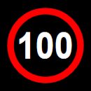
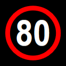
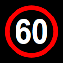
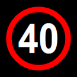
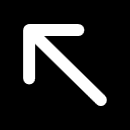
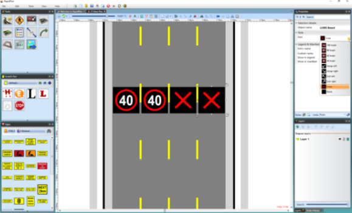

---

sidebar_position: 5
tags:
  - markers-devices
  - australia-only

---
# LUMS board (Australian version only)

This tool helps you create a Lanes Use Management System (LUMS) across a roadway on your plan. There are 10 different LUMS styles available for your plan.

|Patterns                               |           |                                                   |               |
|---------------------------------------------------|-----------|---------------------------------------------------|---------------|
|        | 100 km/h  |         | 80 km/h       |
|         | 60 km/h   |         | 40 km/h       |
| | Merge left|| Merge right   |
|  | Exit left | | Exit right    |
|      | Cross     |      | Blank         |

## Create a LUMS Board

1. Select the **LUMS Board** tool from the Devices tab in the **Tools palette**.
2. Click once to place a LUMS Board over the first lane, then repeat for each lane.
3. Select each LUMS Board and choose its style from **Style** > **Icon** in the **Properties palette**.
4. Right-click to finish.

    
