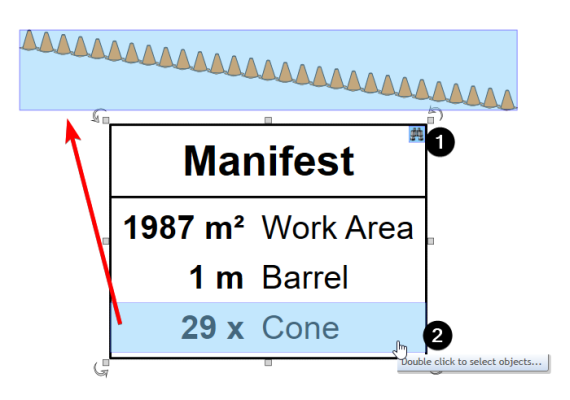
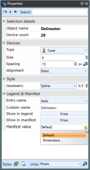
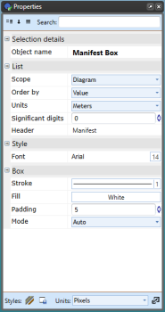
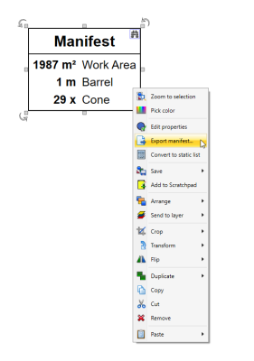
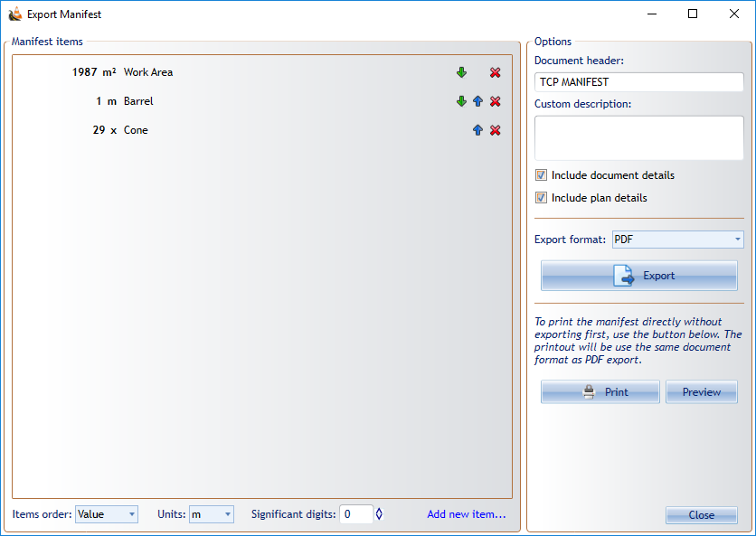
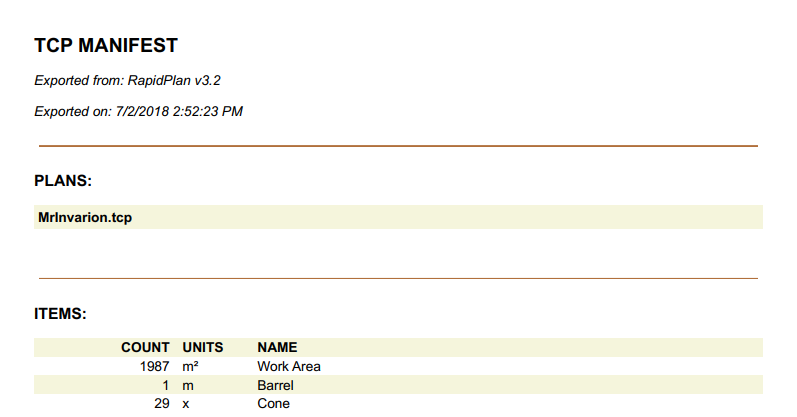

---

sidebar_position: 11
tags:
  - markers-devices

---
# Manifest box

The **Manifest Box** works similarly to the **Legend Box**. When you set an item to appear in the Manifest Box, you can set its **Manifest Value** to its dimensions, where applicable, or its item count. The item count is the default. Like the Legend Box, the Manifest Box can trace entries back to the objects they represent on the plan.

As you can see in the example below, the **Cones** Manifest Value is set to show the number count and the **Work Area** and **Barrel** is set to show the dimensions.

Below is an example of a delineator being set to **Show in Manifest** and selecting the **Manifest Value**.

## Change Manifest Box properties

Below is an image of the Manifest **Properties palette**, showing all of the features that can be adjusted.

## Export Manifest tool

The **Export Manifest** tool allows you to create manifest documents based on one or more traffic control plans, then print or export them in PDF, text, CSV, XML, or JSON format. Access the export tool by right-clicking a **Manifest Box**, or select **File** > **Export** > **Batch Export** > **Export batch manifest...**

Step 1:

1. Right-click the **Manifest Box** and select **Export manifest...**

    

Step 2:

1. Order the manifest items by name, value, or a custom order.
2. Set the units.
3. Set the document header and, optionally, a custom description.
4. Select the export format.

    

The following image shows an example of a manifest exported to PDF.

