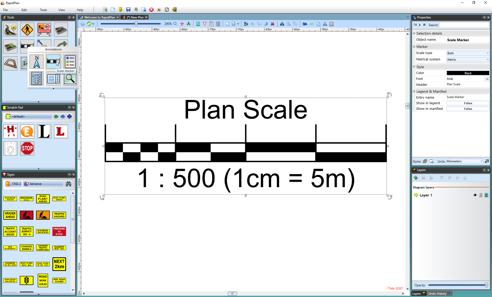

---

sidebar_position: 9
tags:
  - markers-devices
  - mapping-geospatial

---
# Scale marker

This tool is handy for advising viewers of the plan that there is a scale set. You are able to set the plan distance in **Imperial** and **Metric** system.

## Place a scale marker

- Select the **Scale Marker** from the Annotations tab in the **Tools palette**.
- Click once anywhere on your plan to place the marker.
- Edit the values for the marker within the **Properties palette**.

    
