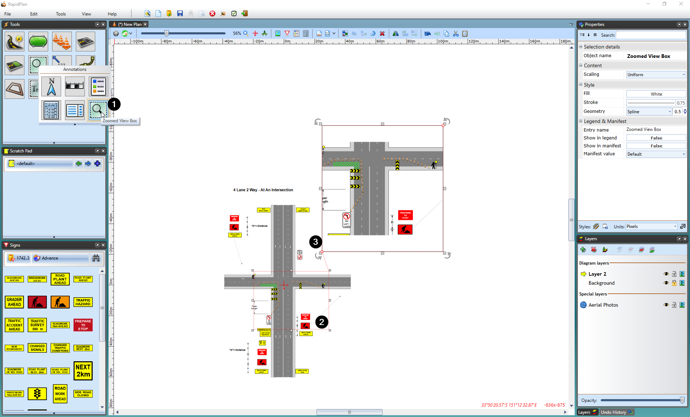
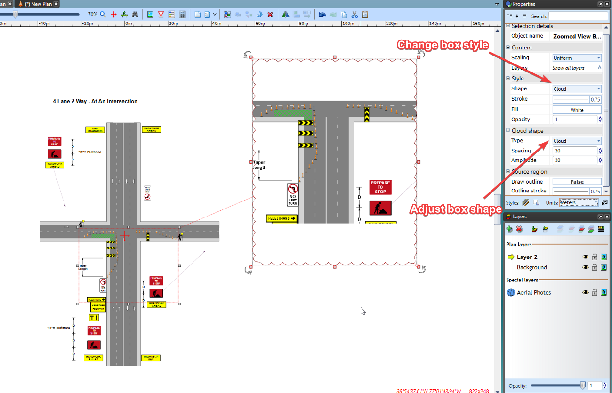

---

sidebar_position: 14
tags:
  - markers-devices

---
# Zoomed view box tool

The **Zoomed View Box** tool allows you to create an inset that presents a detailed view of a specific section in a larger plan.

## Create a zoomed view box

1. Select the **Zoomed View Box** tool from the Annotations tab in the **Tools palette**

2. Select the area you want to enlarge

3. Set the place where you want to put zoomed box

4. Set the size of box

    

## Change zoomed view box styles

The **Zoomed View Box** can be styled to present its content in an ellipse or cloud-shaped box.

Once the zoomed box has been created, select it and a number of options will be available in the **Properties palette** to suit your plan requirements.

