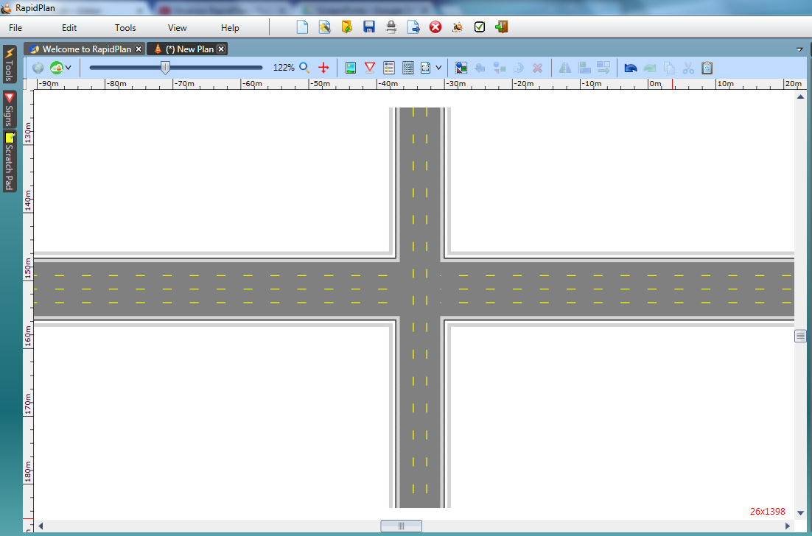
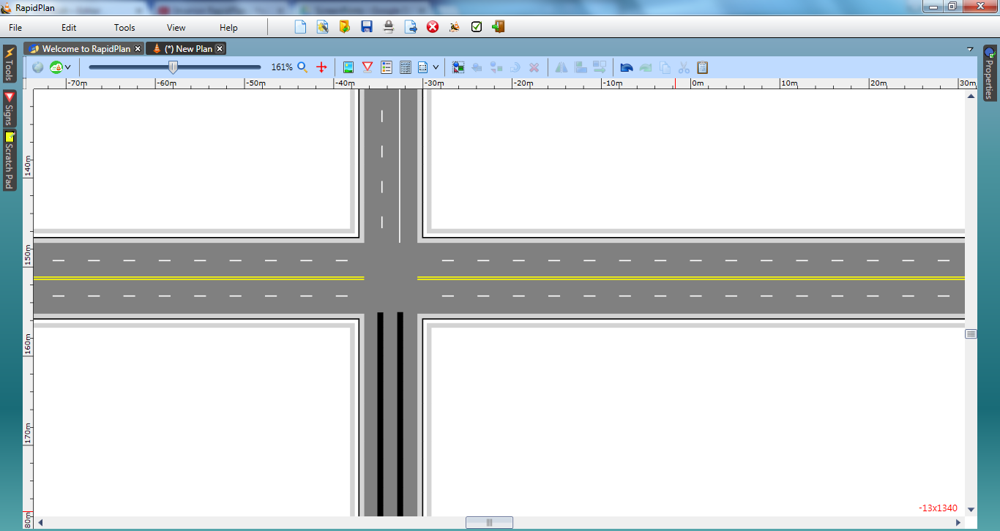
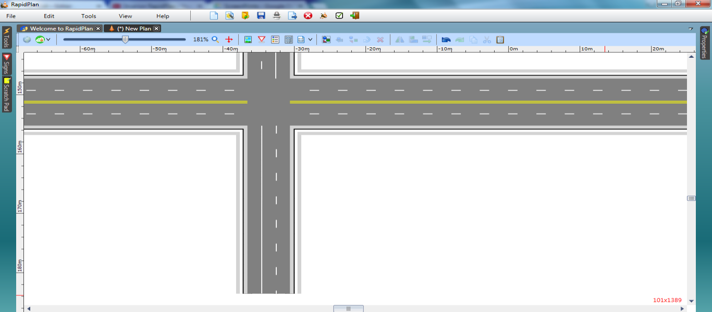
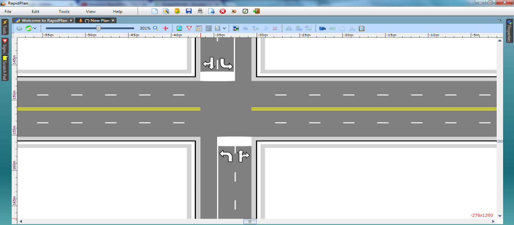

---

sidebar_position: 3
tags:
  - drawing-editing
  - road-tools

---
# Crossroads

Crossroads are similar to T-Intersections in many regards. Our simple crossroad will be a 4-lane east-west and 3-lane north-south junction.

<!--
TODO: images withing tables are not supported in Markdown. Refactor this
 |Crossroad intersection                                     |             |
|-----------------------------------------------------------|-------------|
| [Crossroad_intersection_table](./assets/Crossroad_intersection_table.png)  | **This simple Crossroad intersection makes use of the following items:** - Road tool  - Lane Marker tool  - Lane Mask tool  - Rectangle tool  - Furniture from Signs palette  | -->

## Create the base roads

1. Select the **Road** tool from the Road Tools tab and draw an east-west road. Change it to four lanes.
2. With the **Road** tool still selected, draw a north-south road that intersects the four-lane road and change it to three lanes.

## Set the lane markings

1. Double-click the east-west road. Select the Lane Markings tab and set marker number 2 to type double. Leave the double lines yellow and change the dashed lanes to white.
2. For the north-south road, set marker number 2 to solid. Change both these lanes to white.
3. Using the **Lane Mask** tool from the Markings tab, mask out each of the lines through the intersection.
4. As we will need to completely change the road markings on the southbound approach, mask them out as well.

1. Using the **Lane Marker** tool, draw two new **lane markings** to replace the ones masked out on the southern approach. They are drawn as solid yellow lines by default. Double-click them and change their type as shown below.

## Add the stop bar and turning arrows

1. Using the **Rectangle** tool in the Shapes tab, create stop bars in the appropriate places. Ensure that your rectangle stroke color is white (it will be black by default).
2. Select a **Left turn** or **straight arrow** from the Furniture tab of the **Signs palette** and place it on the plan somewhere. Ensure it is selected, then flip it using the flip horizontal button on the Flip toolbar. Drag it into one of the two required places.
3. Duplicate your modified arrow. Drag the duplicate onto the other side of the intersection as shown.
4. Now select a Left turn arrow and place it in both required places. Make sure you flip it accordingly.

