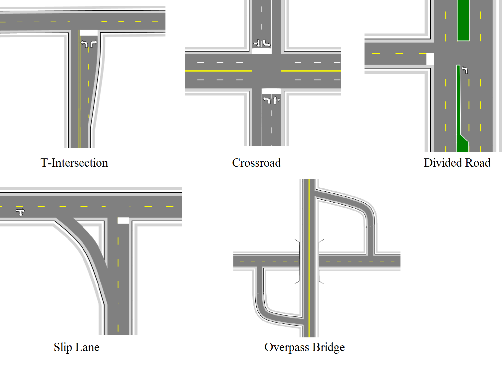

---

sidebar_position: 1
tags:
  - drawing-editing
  - road-tools

---
# What this section covers

This article covers five different **intersections** of increasing complexity. It assumes that you already understand the required road tools and editing workflows.

The process is mapped out step by step, but the screenshots focus on the road in progress rather than every dialog or property change.

This article covers:

