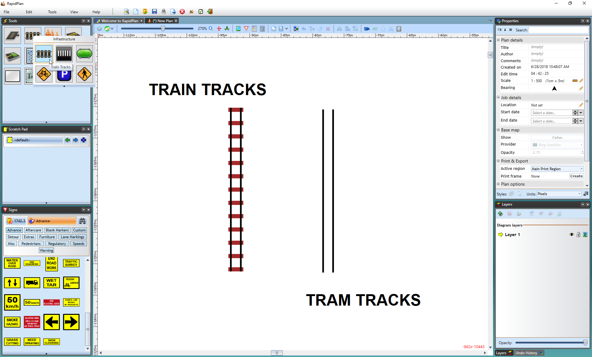
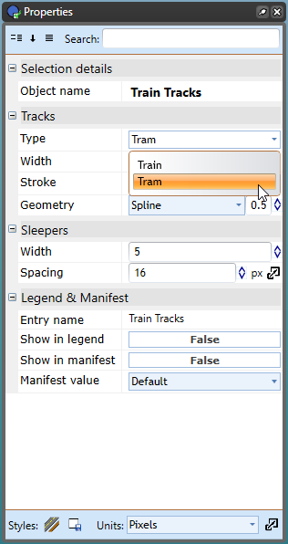
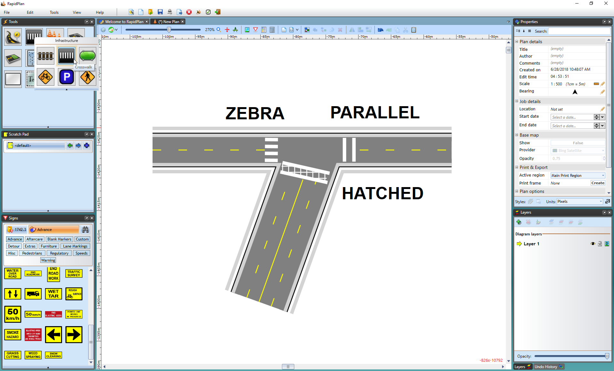
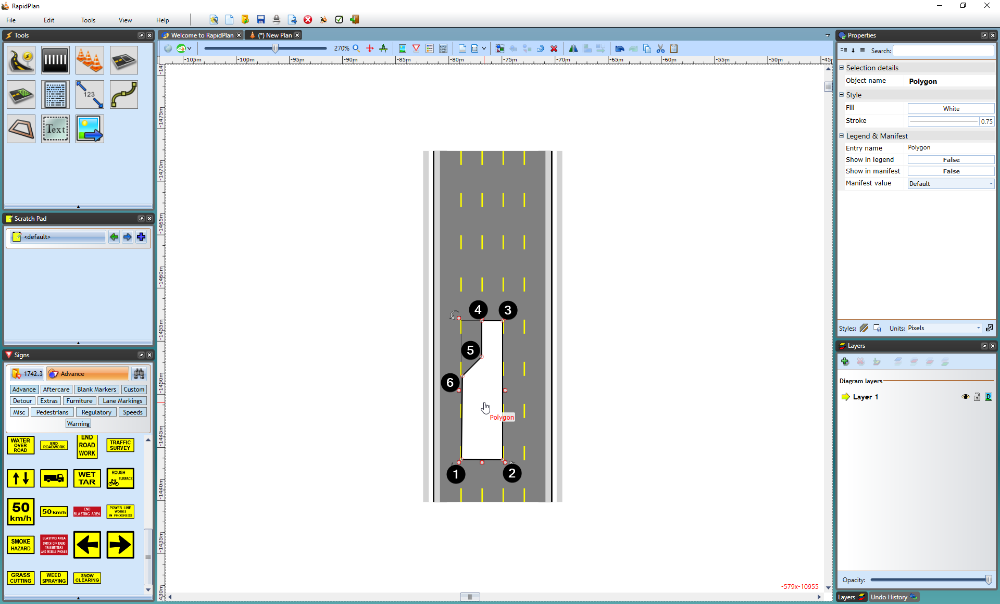
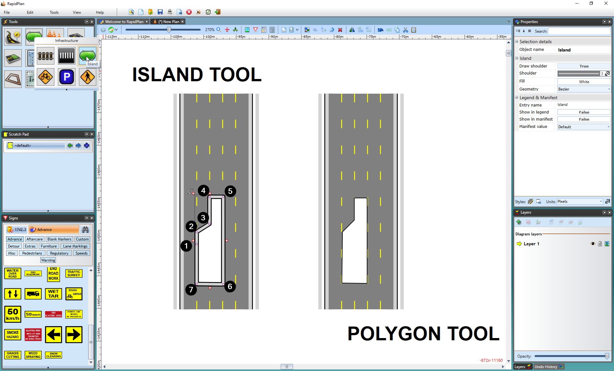
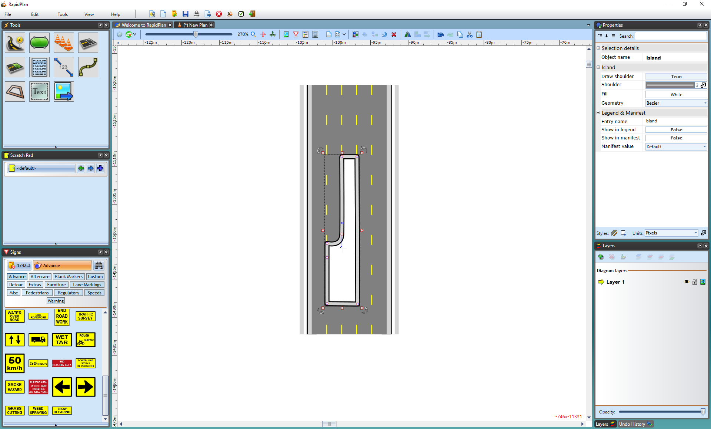
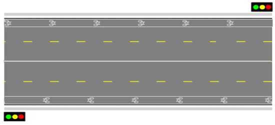
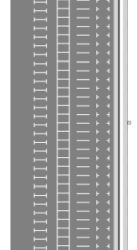
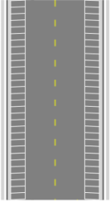
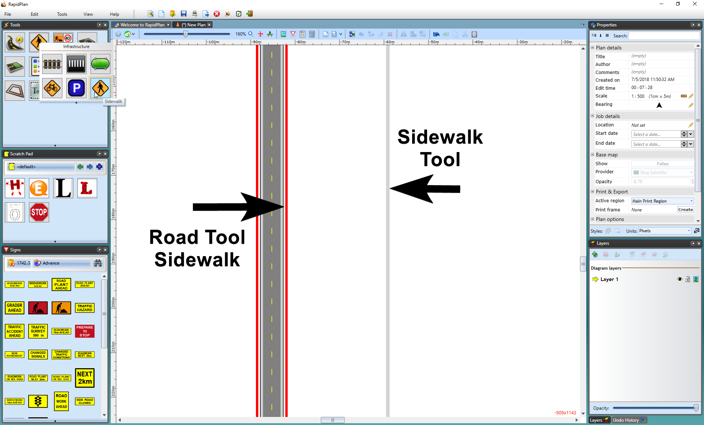

---

sidebar_position: 4
tags:
  - drawing-editing
  - road-tools

---
# Road infrastructure tools

These tools enable you to add infrastructure to your road plans. They can be found in the **Infrastructure** tab of the **Tools palette**.

## Train Tracks tool

The **Train Tracks** tool adds train or tram lines to your plan.

**To place a train line:**

- Select the **Train Tracks** tool from the Infrastructure tab in the **Tools palette**.
- Click once to start your rail line.
- Click at each turn point.
- Right-click to stop drawing.

    

To place a tram line on **Properties palette** change **Type** value from **Train** to **Tram**

## Crosswalk tool

The Crosswalk tool is a handy tool that creates crosswalks on roads, arcs, and roundabouts. There are a few options available when editing the crosswalk. You can change the crosswalk width and type to parallel or hatched. The stripe width and spacing can also be changed to accommodate your specifications.

To create a crosswalk:

1. Draw the road.
2. Select the **Crosswalk** tool from the Infrastructure tab in the **Tools palette**.
3. Select where you want the crosswalk to start.
4. Right-click to finish drawing.

    

Three different types of crosswalks have been created in the screen print above. Crosswalk type can be changed on the **Properties palette**.

## Traffic islands

Learning how to create traffic islands/refuge points and center medians is important. There are two tools that you can use in RapidPlan to create them - the Polygon tool and the island tool.

**Islands with the Polygon:**

Creating islands with the polygon is as simple as tracing out the shape of your island on your road. This is the easier of the two methods.

To create an island with the polygon:

- Select the **Polygon** tool from the Shapes tab in the **Tools palette**.

- Start the island at one of its corners.

- Continue clockwise or counterclockwise, selecting each corner point. Hold **Shift** to keep the island edges straight.

- Right-click to stop drawing, then right-click again to drop the **Polygon** tool.

The picture above shows an example of a click sequence to create an island. Polygon is a free form tool, you can make islands of virtually any shape.

To create an island with the **Island** tool:

- Select the **Island** tool from the Infrastructure tab in the **Tools palette**.
- Start the island at its smallest corner.
- Continue clockwise or counterclockwise, selecting each corner point. Hold **Shift** to keep the island edges straight.
- Right-click to stop drawing, then right-click again to drop the **Island** tool.

    

There are two main differences between using the polygon and Island tool:

**Note that you should never start your island on a steep corner point (anything greater than about 45 degrees). This is because it can cause the shoulder lines to cross over.**

The technique for creating **control points** is simple but requires some practice.

To create a curved island:

1. Draw the island.
2. Right-click to drop the **Island** tool.
3. Select the island.
4. Point to the **control point** you want to curve and hold **Ctrl**. The **control points** turn from red to blue and display curve handles.
5. Drag the curve handles away from the **control point** until the island has the required shape.

    

## Bike Lane tool

The **Bike Lane** tool works similarly to the **Polyline** and **Road** tools. In the **Properties palette**, you can change the bike image from Standard to Shared.

**To place the bike lane:**

- Select the **Bike Lane** tool from the Infrastructure tab in the **Tools palette**.
- Click to start the bike lane.
- Hold **Shift** to create a straight lane, or click to create **control points** to adjust the lane's shape.
- Right-click to finish.

## Parking Bay tool

This tool makes it simple to add parking bays to your plan. In the items **Properties palette** you have a selection of Parking styles. As you can see below, they include sides & corners, full, sides, and corners.

|Parking Bay type options                   |Parking Bays along a road                      |
|:-----------------------------------------:|:---------------------------------------------:|
||   |

**To place a parking bay:**

- Select the **Parking Bay** tool from the Infrastructure tab in the **Tools palette**.
- Click at the first corner and drag out a line (hold **Shift** to keep straight).
- Click again to make the second corner then drag the parking bays out to make their full shape.
- Click a third time to complete it, and right-click to finish.

## Sidewalk tool

The **Sidewalk** tool is used like any **Polyline** tool. In the example below, you can see that the **Road tool**'s sidewalk and the Sidewalk tool's sidewalk are visually the same, however, you have more control over the Sidewalk tool as it is an individual item, such as putting a sidewalk through a grassy patch like in the example below.

