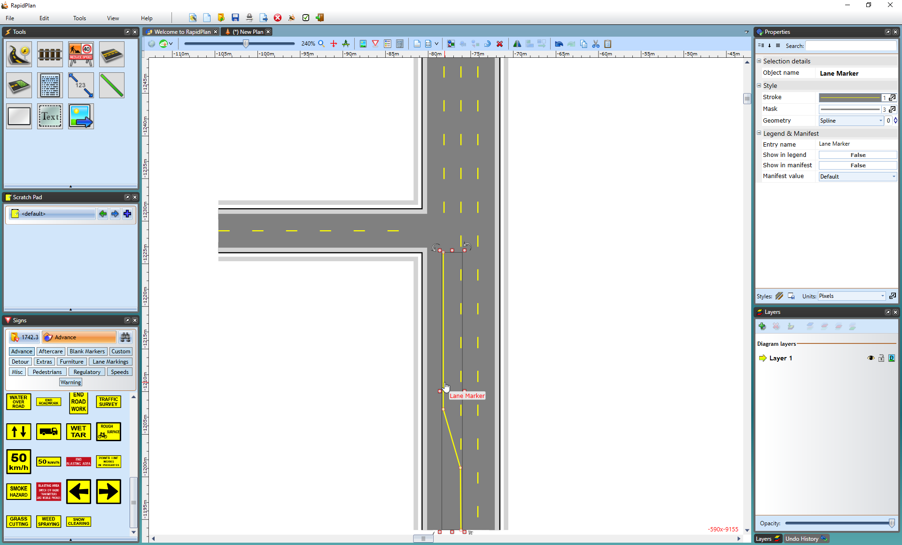
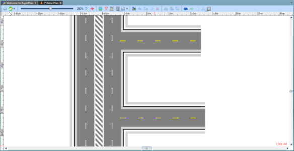
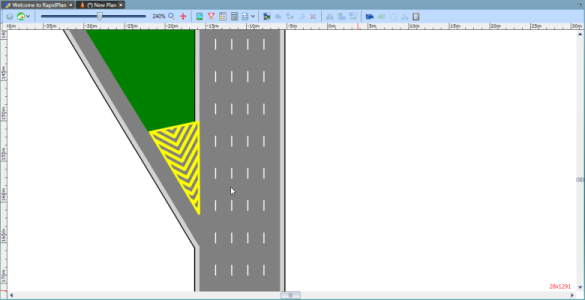

---

sidebar_position: 3
tags:
  - drawing-editing
  - road-tools

---

# Road marking tools

## Lane Marker tool

The automatic **lane markings** on the road always perfectly follow the curve of the road. Sometimes you will need to create something different, so RapidPlan has a custom Lane Marker tool. In a lot of cases, you will use the **Lane Marker** tool in conjunction with the Lane Mask tool. The example below will show you how to combine the two.

In this example we will replace the current dash lane marker with the solid double line lane marker.

Firstly, we need to remove part of the existing lines. We do this with the Lane Mask tool (see [Road Masking](./road-masking-tools)).

Next we select the Lane Marker tool and draw in the edge merge the line.

**To create a new lane marking:**

- hover your cursor over **Markings** in the **Tools palette**
- select the **Lane Marker** tool
- click once on your road where you want to start
- move the mouse, clicking to place turn points as required
- when you are finished, right-click to stop drawing
- right-click again to clear the cursor

    

You can change the lane marker to any of the standard lane styles (Dashed, Solid, SolidDash, DashSolid and Double) or change its color by accessing its properties screen. You can also set **Lane Marker** Defaults the same way you set the Road Defaults as specified in section [Setting a Default Style](/rapidplan/drawing-snapping-and-editing/object-properties-and-styles).

**To change the properties of a lane marking:**

- double-select the **lane marking**
- on its properties screen, make any required alterations to the type and color of the line
- click Ok to accept the changes

## Flush Median tool

This tool works like any Polygon where you click to place each of its corners and can adjust the **control points** to get the shape you need.

## Chevron Flush Median tool

This tool also works like a polygon, with the first click forming the tip of the chevron.

**To place the Chevron Flush Median tool:**

- select the Chevron Flush Median tool from the Markings tab in the **Tools palette**
- your first click will be the top point of the shape (in the direction of the chevron)
- then click for all other consecutive points
- right-click to finish

    
