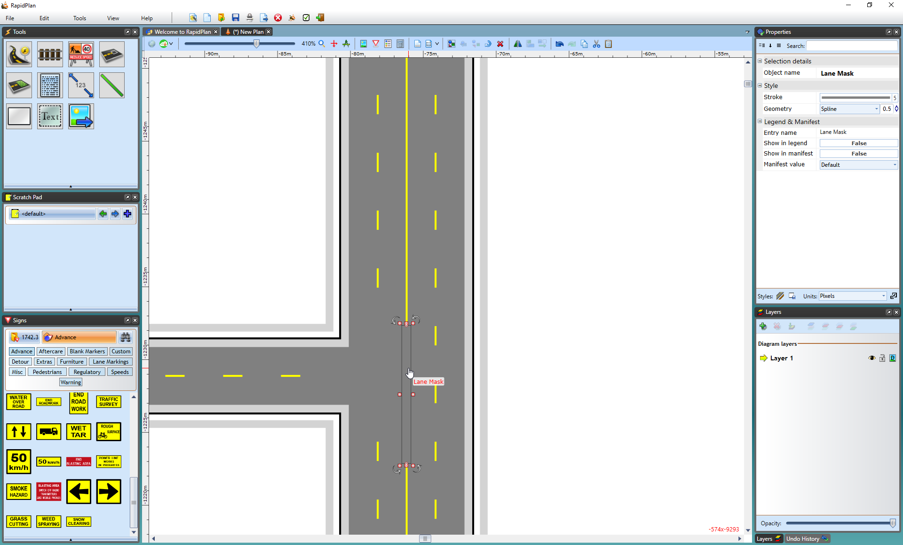
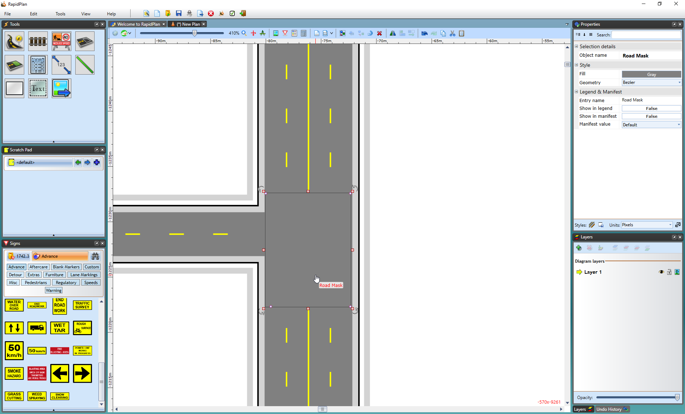
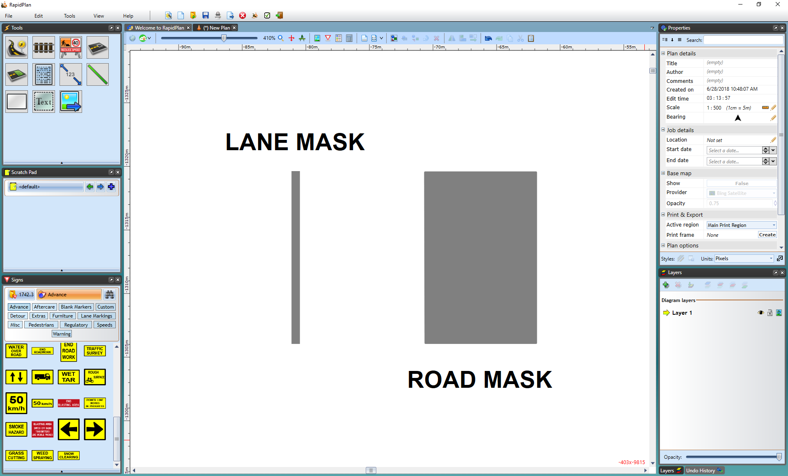

---

sidebar_position: 2
tags:
  - drawing-editing
  - road-tools

---

# Road masking tools

These road masking and marking tools are necessary if you need to remove and/or change **lane markings** on the road. All of these tools can be found in the **Markings** tab of the **Tools palette**.

## Lane Mask tool

Sometimes, it may be necessary to remove a small section of a **lane marking** on a road. This is often the case when building intersections. You can remove a small section of **lane marking** by using the **Lane Mask** tool. It's located within the **Tools palette** in the Markings tab.

To mask a lane marking:

1. Open **Markings** in the **Tools palette**.
2. Select the **Lane Mask** tool.
3. Select and hold the marking where you want the mask to start.
4. Drag along the line to draw the mask.
5. On curves, select each turning point as the mask follows the road.
6. Right-click to finish.

    

The lane mask tool is no different to any other object in RapidPlan once it's been placed, you can select it and shift its **control points** if you didn't manage to completely cover the line in the first attempt.

## Road Mask tool

This tool operates similar to the **Lane Mask** tool and removes sections of lane markers but instead of covering only a lane width, you can cover an entire road to remove markers. This comes in handy particularly when you have several lanes on roads that meet at an intersecting point and you need to remove many lane markers.

To mask lane markings with the **Road Mask** tool:

1. Open **Markings** in the **Tools palette**.
2. Select the **Road Mask** tool.
3. Draw a perimeter around the lane markings you want to mask.
4. Right-click to finish.

    

Again, there are **control points** and **resize handles** to allow you to adjust the shape and size of the road mask.

