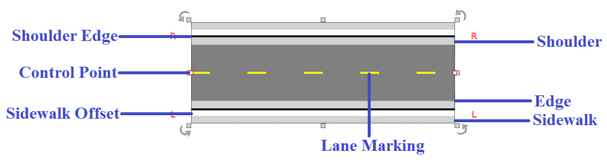
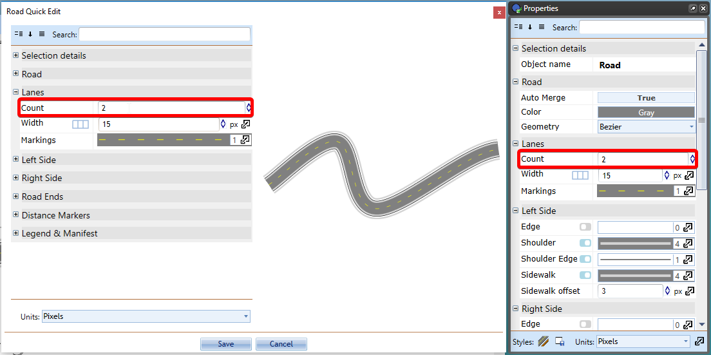
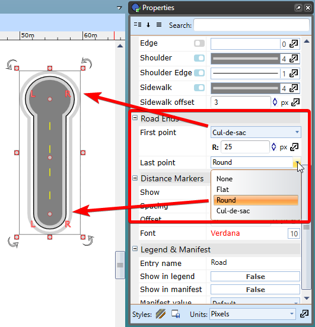

---

sidebar_position: 1
tags:
  - drawing-editing
  - road-tools

---
# Drawing a road

## Components of a RapidPlan road

The road has a number of different parts. It is well worth familiarizing yourself with them.

## Basic drawing techniques

Drawing with the **Road** tool is simple. As you move the pointer after you start drawing, the roadway follows the pointer. Each time you select the canvas, RapidPlan places a new turning point represented by a **control point**.

### Draw a road

1. Select the **Road** tool from the **Tools palette**.
2. Select the canvas to start drawing the road.
3. Select each turning point.
4. Right-click to stop drawing.
5. Right-click again to drop the **Road** tool.

### Keep sections straight

A simple trick allows you to draw perfectly straight roads. By holding **Shift**, RapidPlan will make sure that each **control point** is placed in a perfectly straight line.

### Set the number of lanes

There are two simple ways to add and remove lanes to roadways:

1. Double-click the road to open the Quick Edit dialog.
2. Select the object and change the number of lanes from the **Properties palette** within the right pane.

### Insert road ends

There will be occasions where you need to insert a road end or a dead-end road. To do this we simply make a road and change its properties as seen in Figure 6.6.

You can select from flat, round or cul-de-sac. You can adjust sizing and **control point** of inserted road end.
