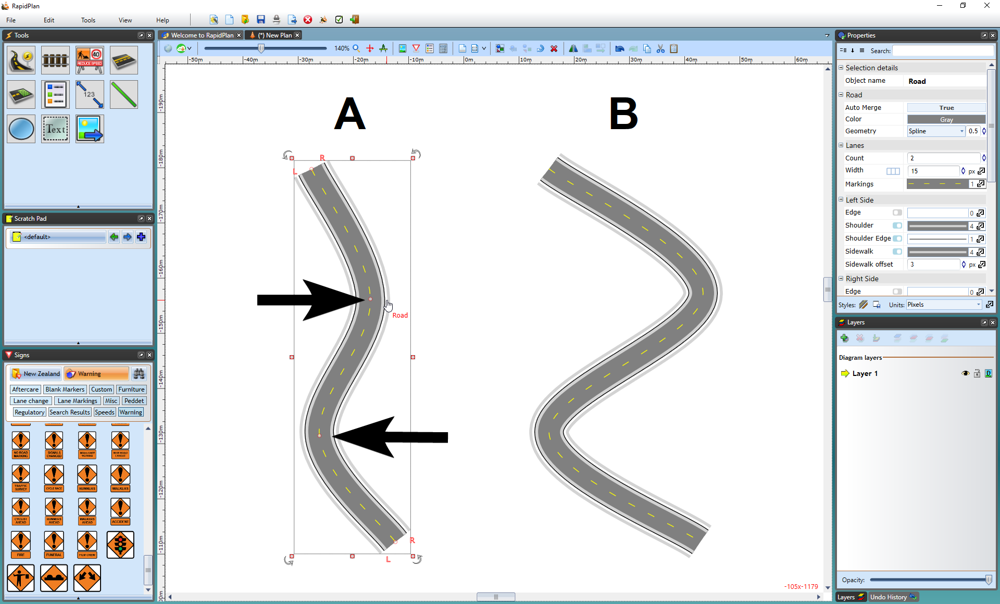
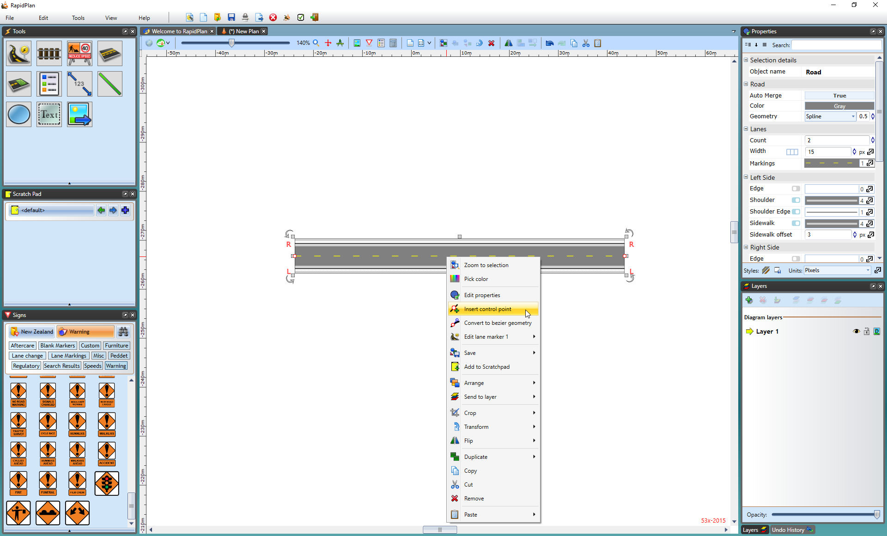
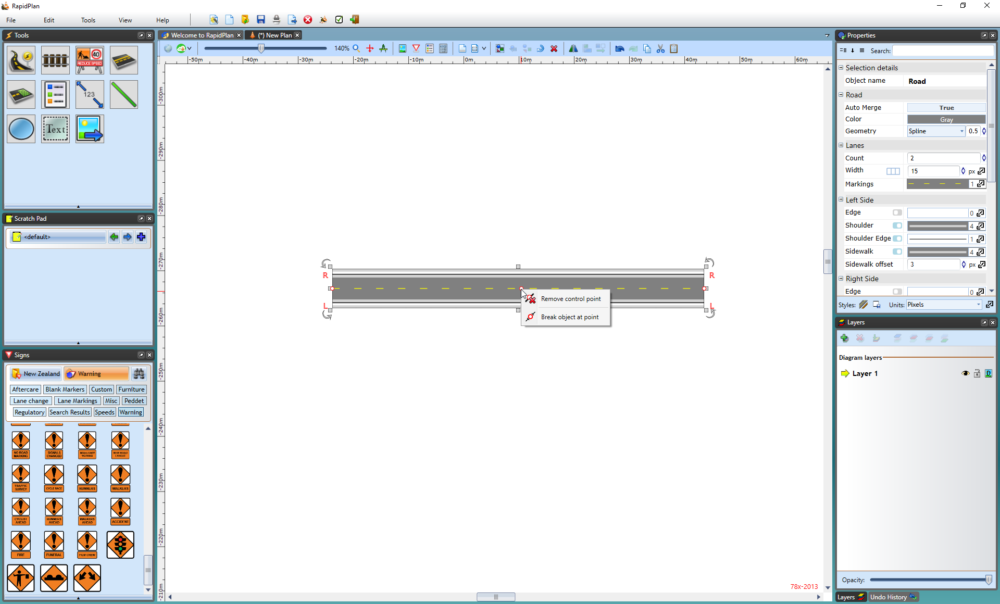

---

sidebar_position: 2
tags:
  - drawing-editing
  - road-tools

---
# Editing the shape of an existing road

Like any other object in RapidPlan, the shape of the road once drawn can very easily be edited by shifting it's **control points**.

To edit the road's shape:

1. Select the road to display its **control points**.
2. Drag the **control points** until the road is the correct shape.
3. Hold **Shift** while dragging to align the **control points**.

In the image below, Road A is the original road. Road B has had the 2nd and 3rd **control points** adjusted to change the shape of the road.

## Add and remove control points

There will almost certainly be circumstances where you need to add or remove a **control point** from a road to fine tune its shape.

Adding **control points** allows you to create extra turn points to your road, hence extra curves.

To add a control point:

1. Select the road.
2. Right-click where you want to add the **control point**, then select **Insert Control Point**.

    

Removing **control points** is equally simple as adding them. You do need to remember that you can only delete end **control points** if there is at least one **control point** in between. That is to say, that there must be at least two **control points** on every road.

To remove a control point:

1. Select the road.
2. Right-click the **control point**, then select **Remove Control Point**.

    
