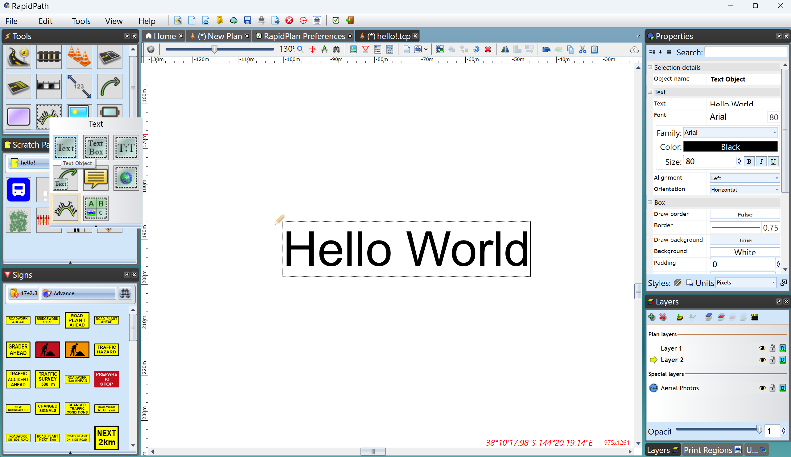
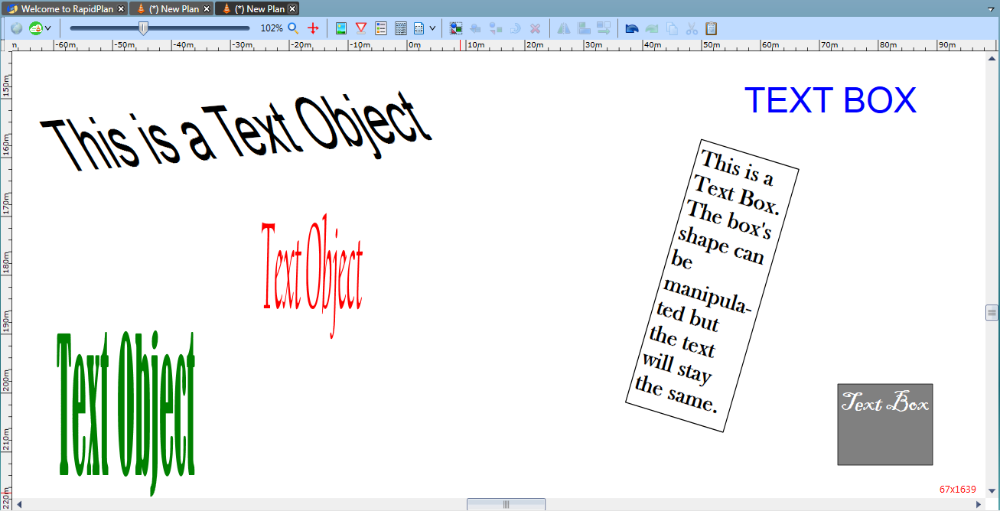
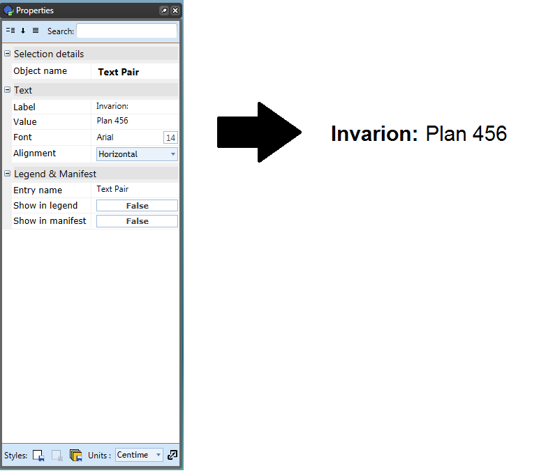
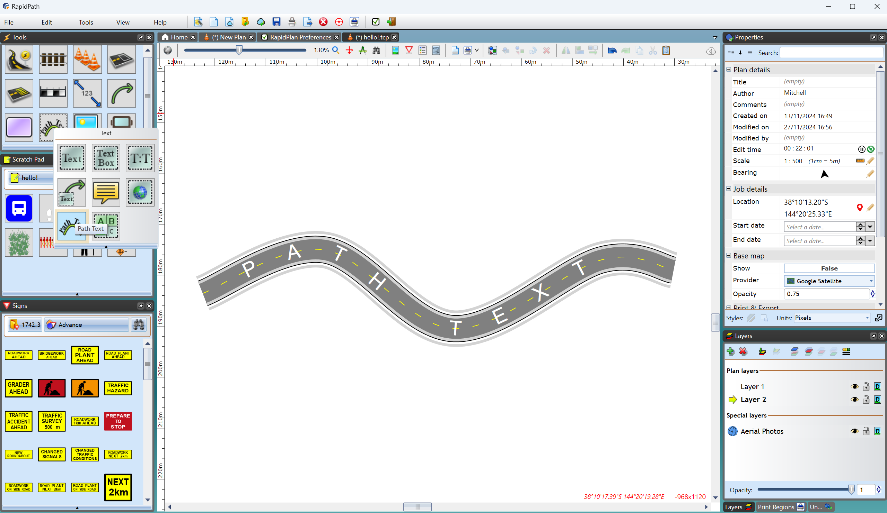
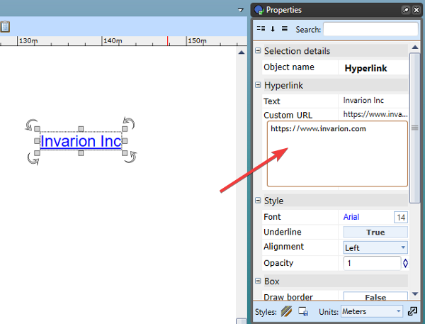

---

sidebar_position: 1
tags:
  - text-rich-text

---
# Text tools

Because they are different, the text tools behave differently to the other tools. They are however exceptionally easy tools to use. You can enter and edit text in these objects on the canvas simply by double-clicking directly on the text, even on **grouped objects** and signs.

## Text object tool

This tool creates an **object** out of text that can be manipulated like any other object.

- Select the **Text Object** tool from the Text tab.
- Place it on the canvas with a click, then a writing cursor will appear in that place.
- Type in your content then use the **Properties palette** to make any changes.
- If you wish to change the text content, font style, size or color, or to center the text, click the Text tab in properties and make any necessary adjustments.
- If you wish to paint the background of the text box, click the Box tab in properties and make your adjustments.

    

## Text box tool

The Text Box is created in a similar way to the Text Object tool but the products are different. The difference between the **Text Object** and the **Text Box** tools is the Text Object literally creates an object that can be stretched and manipulated like any other in RapidPlan, whereas a Text Box is literally a text box.

## Text pair tool

The **Text Pair** tool works similarly to the regular text tool but has limited editing options. It provides a label and value without background-color or bold-font options.

### Use the Text Pair tool

- Select the **Text Pair** tool from the Text tab.
- Select the canvas to place the text box, then enter the **Label**. In the example, the label is `Invarion`.
- Enter the **Value**. In the example, the value is `Plan 456`.
- Use the **Properties palette** to set the orientation to **Horizontal** or **Vertical**.

    

## Path text tool

Just as the name implies, this tool allows you to create text fit to follow a path. It is used as a hybrid of a spline and text tool.

## Hyperlink tool

The Hyperlink text tool can be used on your plans to reference online resources and other files via clickable links on exported PDF documents.

To activate the tool, select **Hyperlink** from the Text tab.

Click the canvas to type the text you wish to have as your clickable link. In the **Custom URL** area, you can enter the link for the website or document you wish to hyperlink.

When the plan is exported to PDF, the reader will be directed to the web page or document when the hyperlink is clicked.

