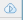
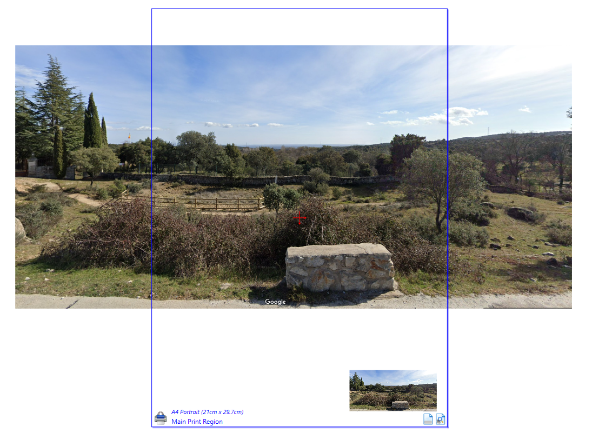
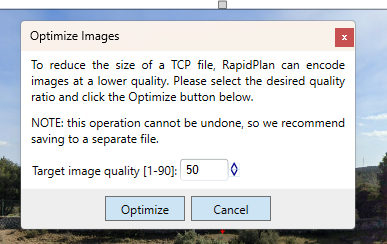

---

sidebar_position: 5

---
# Cloud Plan File Size Management

When editing a cloud plan in RapidPlan, you might notice an indicator in the **Cloud Plan Details** dialog box (accessed by clicking  button in the top-right of the [Toolbar](/docs/rapidplan/the-toolbar/the-toolbar.md)), displaying whats percentage of the potential size of a plan has been used.

Cloud plans have a limit of 25mb per plan, determined by the maximum amount of data that can be transferred in a 'single request'. If a cloud plan's file size expands beyond this limit, it will not be able to be saved to the cloud.

If you encounter this limitiation, you might choose to save a copy of your plan locally where its size isn't capped as such (click **File** > **Save as**, saving as a **.tcp** file). 
However this is most often not necessary, as it is likely that your file's size can be reduced:

## Reducing a Plan's File Size

The dominant factor that determines a plan's file size is the images that are placed on the plan. Therefore, by controlling the size of these images, a plan's file size can be reduced.

A common contributing factor is that if you start with a large image and then resize it in RapidPlan, this will not in turn reduce the file size of that image in your plan. For example, in the image below I have duplicated the larger image before reducing the size on canvas of one copy - both of these without modification will occupy the same amount of storage space.

If an image is set so that it will be small on the plan, for example the lower copy of the image in the example above, we can reduce its quality without much consequence as the reduced pixel count will not be noticeable to a certain extent.

### Reducing an image's quality

The quality of the images on a plan can be optimized by clicking **Tools** > **Advanced Tools** > **Optimize Images**. You will need to have saved the plan prior to doing this, and note that it will apply to *all* images in the plan. If there are any images in the plan that you would prefer to not be optimized, simply remove them temporarily:

Remove images you don't want optimized by selecting them and cutting them (**CTRL** + **X**), or adding them to [Scratchpad](/docs/rapidplan/scratchpad/the-scratch-pad.md) temporarily (**Right-click** + **Add to Scratchpad**).  Alternatively, you might choose to move the images you *do* want to optimize to a blank plan that you will later delete - optimize them there, and then return them to your working plan.

Once **Optimize Images** is clicked, you will be able to choose to which degree you would like to optimize images:

*A lower value* will create a lower quality image, *A higher value* will leave more pixels, reducing the file size by less but making the image more clear.
