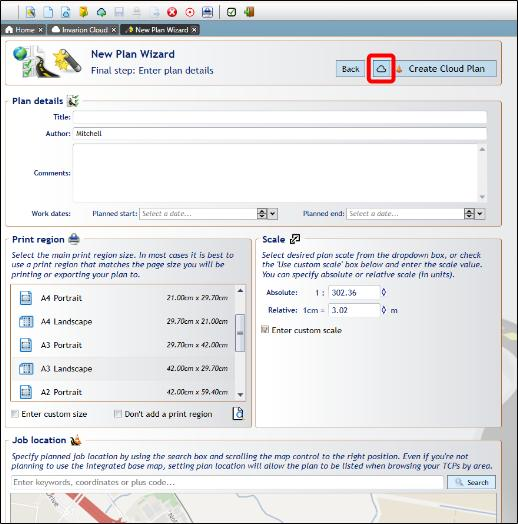
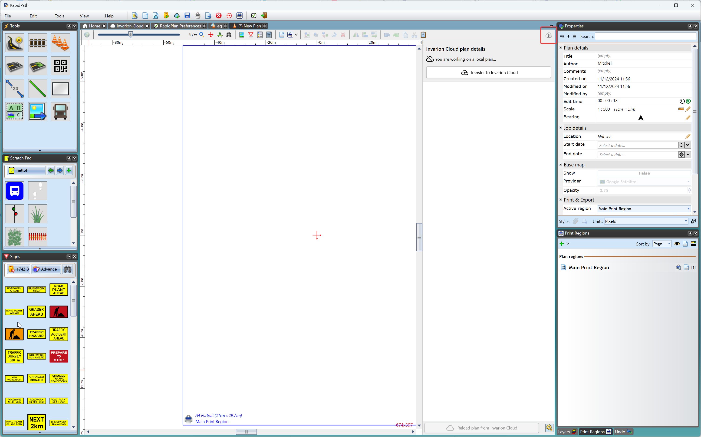
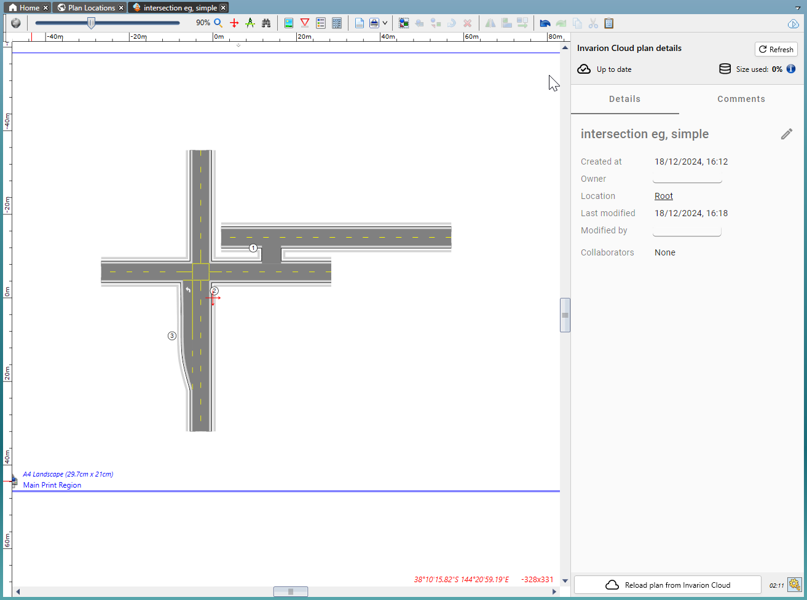
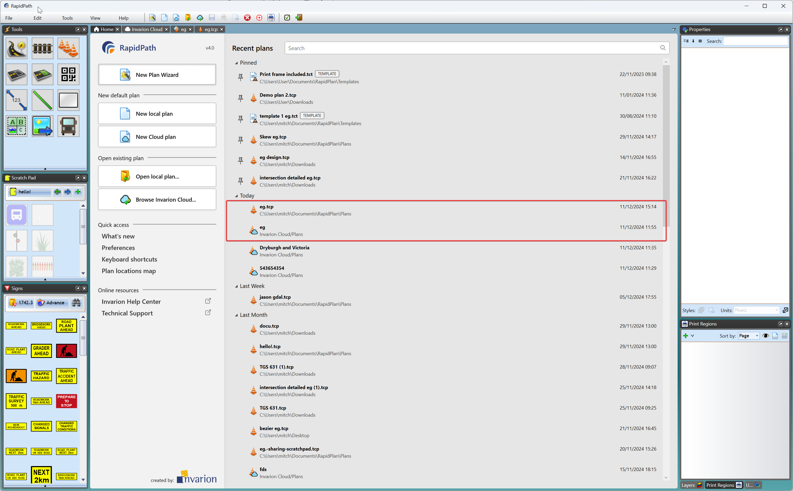

---

sidebar_position: 1

---
# Creating and Uploading Cloud Plans

RapidPlan now features incorporated cloud functionality, allowing you to:

- Store your library of plans securely, and access them from anywhere.
- Seamlessly collaborate with team members or clients by adding them to a plan and providing editing or view-only access.
- Add comments and create comment threads to discuss aspects of your plan during the design process.
- Quickly share a link to your plan so relevant stakeholders can view a read-only version on their mobile devices.
- Plan files created in the desktop applications can be opened and edited by our web applications, and vice versa.

## Creating a Cloud Plan

As discussed in [The Home Screen](/docs/rapidplan/the-home-screen-and-starting-a-plan/the-home-screen.md), a cloud plan can be created in a number of ways:

[New Plan Wizard](/docs/rapidplan/the-home-screen-and-starting-a-plan/the-new-plan-wizard.md), found on the home screen as well as in [The Toolbar](/docs/rapidplan/the-toolbar/the-toolbar.md) can be used to create cloud and local (locally saved) plans. In the final step of creating a plan using New Plan Wizard, the button highlighted below will decide whether a plan is saved to the cloud or locally.

A cloud plan can also be created by clicking **New Cloud Plan**: Note this will create a *default* plan befitting the defaults you have set (in Tools > Preferences > Defaults in the [Toolbar](/docs/rapidplan/the-toolbar/the-toolbar.md)). Note that default plans do not have a location set initially and so won't have aerial mapping available. If necesary to add a location to a default plan: Click **F2** to open the *Edit Plan Properties* menu > uncheck the **Don't Set Location** box > choose your location.

## Uploading an Existing Plan to the Cloud

If you have a plan or plans saved locally they can be saved to the cloud in one of two ways:

### From the Workspace

To save a local plan that you have open in RapidPlan to the cloud: Simply click the **Invarion Cloud Plan Details** button in the Toolbar on the top-right, highlighted below.

Then click **Transfer to Invarion Cloud**, choose the file name you would like to use initially for that plan in the cloud, and which folder you would like to save it to (these can be updated later if need be).

Now that the plan is a saved to the cloud, **Invarion Cloud Plan Details** menu will display information about the plan, its [collaborators](./sharing-cloud-plans.md) who have editing privleges, and [Comments](./comments-in-the-invarion-cloud.md) added to the plan.

Doing this will leave the locally saved copy of your plan as is. Changes and saves to the cloud file you create will not be applied to the local file.

If you want to return to working on the local version, you will find it in the same location in your computer's File Explorer. It can also be spotted in your Recent Plans in the RapidPlan [Home Screen](/docs/rapidplan/the-home-screen-and-starting-a-plan/the-home-screen.md) - note the *cloud* icon indicating which version of the file is saved to the cloud.

