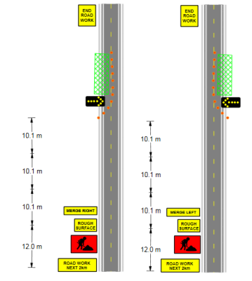
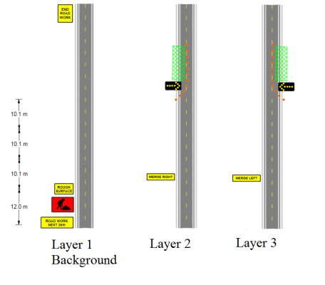

---

sidebar_position: 4

---
# Making the Most Out of Layers

Users who master using layers will find themselves considerably more productive than those who do not. As described earlier, the main (but not sole) advantage offered by layers is the ability to produce multiple plans on the same road base map, but more experienced users will figure out more productive ways to utilize layer functionality.

## General Guidelines When Using Layers

Here are a few general guidelines that will help you make the most out of the layer functions.

### Always Keep Your Roadway the Background

Keeping your road on the background is almost always the most sensible place. Reordering layers in RapidPlan is possible as described above, but keeping your roads on the background will be easiest since whichever layer is listed at the top of the list will always be drawn on the canvas first - all other items on following layers are drawn in subsequent order. This means that unless you want your signs and devices to appear under the road, it should be on the bottom layer.

**Note:** In the above example objects are in Layer 1 and the road is in Layer 2.

### Consider using at least one other Layer at *all* times

Even if your plan is to have only one traffic scheme on your road base, it's still usually a very good idea to have your traffic scheme on a separate layer to the road. The reason for this is simple: Once you are working on a given layer,
you can't accidentally change, move or even select an object on another layer. This has the obvious advantage of making, selecting, and altering objects (particularly small ones) which overlap other items on your road base (like line markings/corner pieces/traffic islands) much easier.

It also means that if you decide you really aren't happy with the traffic guidance scheme (or need to completely change it because of feedback from a road body) you can simply wipe the traffic guidance scheme layer in a single button stroke, rather than individually pick through and delete each item one by one.

### For Multi-Stage Works, keep each Scheme in the same File

The benefits of this are obvious; one file with each stage of the works neatly packaged in a single place.

### Name your Layers appropriately

Two weeks after drawing the plan you will probably remember what each of the 6 schemes in your plan was designed for, but what about a year down the track when you are re-excavating the same site? Chances are you might have forgotten (or another user is retrieving the plans from an old site). So name your layers appropriately. Some simple, self-explanatory names might be:

- Stage 1 lane closure for valve removal
- 4 week advance notice of closure
- Footpath closure for re-concreting
- Aftercare signage before spray seal

### Don't have different Road Sections on different Layers

It's never wise to have more than one road section in the same file. Doing so is likely to lead to confusion, when you have say 4 road sections, with 3 traffic schemes each. Unless you name your layers very carefully, you are likely to loose track of which layer scheme corresponds to which road base.

### Carefully plan which elements overlap Layers to avoid unnecessary reproduction

Sometimes, there will be elements that you wish to draw on multiple layers.

Take a look at this simple example below:

It is a simple, but very typical situation where there are works to be completed across two stages. In each case, four of the five signs are common (Road Work Next 2km, Symbolic Worker, Rough Surface and End Road Work) as are the distances between each of the elements on the plan.

The only objects that change on the plan are the **Merge Right** and **Merge Left** signs and the work site location, cones and arrow trailer.

Therefore, it would be wise to:

- Create the road and common signs on the background
- Place the left lane specific items on Layer 1
- Place the right lane specific items on Layer 2

Notice in the image that there are no items that have been drawn more than once, meaning that the layout is optimized
