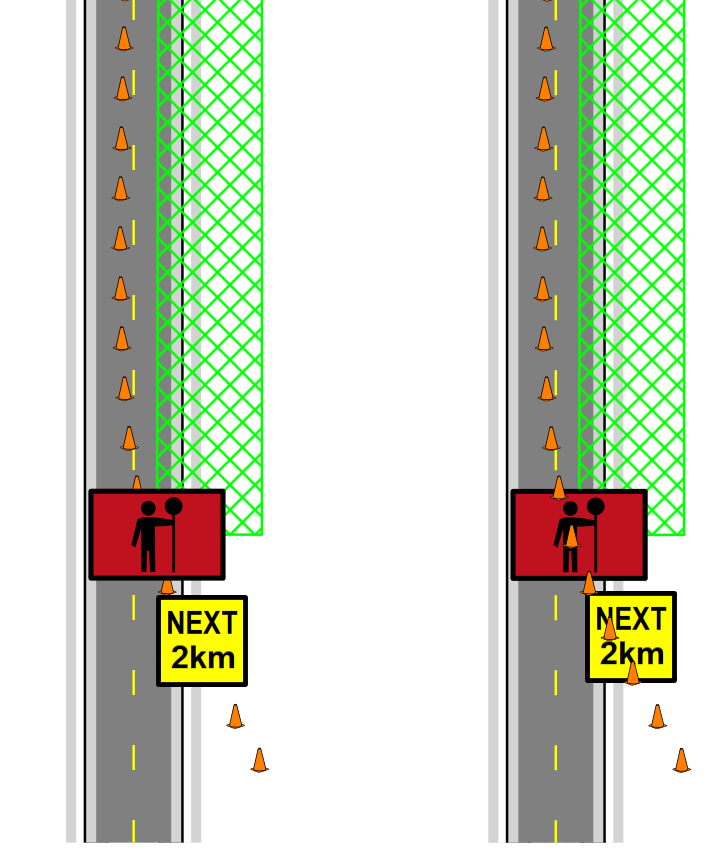
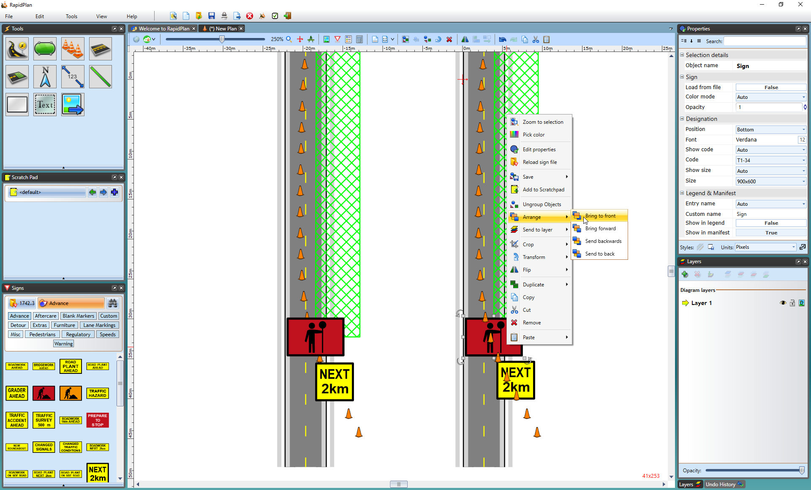

# Object order within a layer

Objects in the same layer are drawn in an order, often called their z-order. Changing that order lets you place one object in front of or behind another object on the same layer.

## Change object order

To change object order with the context menu:

1. Select the object.
2. Right-click the object.
3. Open **Arrange**.
4. Choose **Bring to front**, **Bring forward**, **Send backward**, or **Send to back**.

You can also use keyboard shortcuts:

- **Alt + Home** brings the object to the front.
- **Alt + Page Up** brings the object one step forward.
- **Alt + Page Down** sends the object one step backward.
- **Alt + End** sends the object to the back.

## Layer scope

Object ordering only applies inside the current layer. If an object is on a lower layer, bringing it to the front still keeps it behind objects on higher layers.

To change that relationship, move the object to another layer or adjust the layer order.
