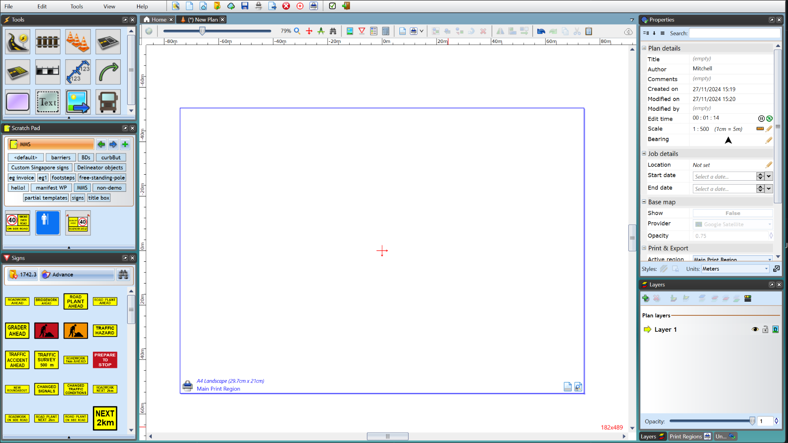
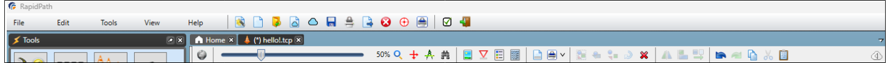
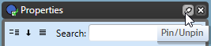
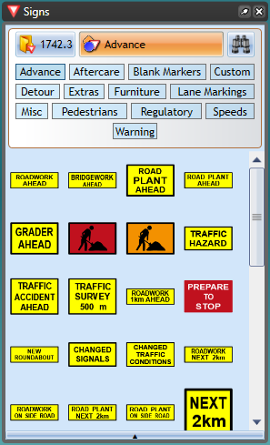
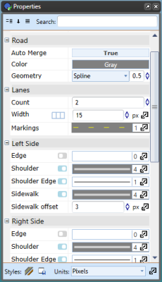
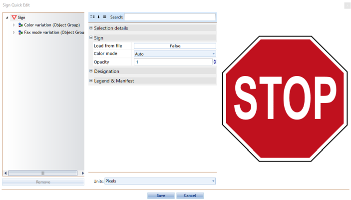

---

sidebar_position: 1
tags:
  - workspace

---
# Workspace and palettes

For the purpose of this explanation we will be using the **New Default Plan** in the following section

Before you get started with RapidPlan, you should probably get to know your way around the main screen. It has been designed to be intuitive, easy to follow and to allow you the maximum available working space to create your traffic plan.

There are three main components of the RapidPlan **workspace**:

- The toolbar
- The palettes
- The canvas

Organizing your **workspace** is simple as each of the items that sit on the canvas can be moved around. Generally, your screen will be laid out similar to as is shown below.

## Toolbar

The toolbar houses most of the "plan-wide" tools that you will use for your plan such as the flip tools, zoom tools, and various special mode options.

For full details on the toolbar, see [Application toolbars](./application-toolbars).

## Palettes

There are five main palettes that will appear on the screen initially, which between them contain virtually all the tools you will use in creating your plan. There are three tabs that appear vertically docked to the left of your canvas; the signs palette, the scratchpad and the tools palette, while the properties and layers tabs will appear to the right of your canvas.
When hovered over with your mouse the palettes become visible, you then have the option to click on pin/unpin (right corner of the palette) or to click on the "x" to close the palette. You can also right-click on the top bar of the palette and choose to have your palette float anywhere on the screen.

### Signs palette

This palette contains road signs you will need to create your traffic guidance scheme. It also carries an array of street furniture and vehicular plant which you can use as part of your site plan. The signs are listed by state allowing you to set the region you are working in. Depending on which countries sign pack you have installed, you may have multiple regions to choose from (for instance in both the United States and Australia, there are various State signage packs available to choose from
as well as the national signage). The button on the top left of the palette allows you to select your state displaying the relevant signs that you are likely to need. The other two buttons allow you to search signs by category or using a search bar.

Further details can be found in [Signs palette](/rapidplan/signs-and-scratchpad/signs-palette).

### Properties palette

The **Properties palette** displays all the information pertaining to any selected signs, tools, markers or objects that is currently selected. This is where you can change fonts, colors, lane markers, etc. of the selected feature.
If no object is selected on the canvas at the time, the **Properties palette** will display information about the plan itself.

You can also double-click an item from your plan to display the property parameters in Quick Edit mode.

For details, see [Object properties and styles](/rapidplan/drawing-snapping-and-editing/object-properties-and-styles).

### Tools palette

The **Tools palette** contains most of the tools you will use to construct the features of your plan.

For details, see [Tools palette overview](/rapidplan/tools-palette/tools-palette-overview).

### Scratchpad

**Scratchpad** is used to store objects that you commonly use to make them easily accessible.

Further details can be found in [Scratchpad](/rapidplan/signs-and-scratchpad/scratchpad).

## Canvas area

The Canvas area is the central area in which plans are created.

For canvas movement and zooming, see [Canvas navigation](./canvas-navigation). For **print regions** and output setup, see [Printing and export](/category/printing-and-export).

For details on how to manipulate objects on the canvas, see [Drawing, snapping, and editing](/category/drawing-snapping-and-editing).

For information about importing mapping to the canvas, see [Basemaps and spatial data](/category/basemaps-and-spatial-data).
