---

sidebar_position: 1
tags:
  - workspace

---
# Application toolbars

The toolbar features three sections.

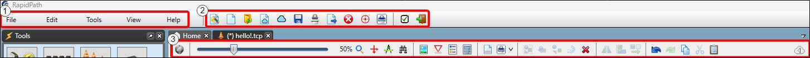

## Section 1

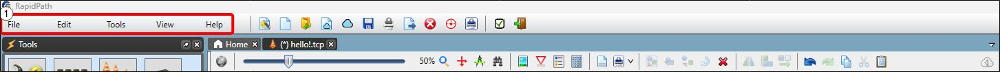

|Title         |                                                                 Function     |
|----------------|----------------------------------------------------------------------|
|**File**|Open, save, close and export/print plans.   Open the Invarion Cloud.  Restore a prior session.  Exit RapidPlan.  |
|**Edit**|Undo/redo.  Cut/copy/paste/duplicate.   Make selction/arrangement/transformation changes to a selected object or group of objects.                                                |
|**Tools**|Text Variables.   Object Styles and Preferences.   Import Files.   'Save object as..'  Sign Tools and Advanced Tools.      |
|**View** |Toggle visibility of different pallets.  Open Layout Manager.  |

## Section 2

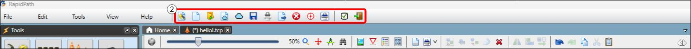

| Icon |Function      |  Description|
|------|----------|-----------------|
||**New Plan Wizard**|Opens the New Plan Wizard to create another plan.                             |
||**New Default Plan**|Creates a new plan, bypassing the Plan Details and New Plan Wizard - creating a new plan based on your system preferences.                                                |
||**Open Plan**|Open a Plan.      |
||**New Cloud Plan** |Create a new *default* plan that is stored in the cloud, bypassing Plan Details and New Plan Wizard.|
||**Browse Invarion Cloud**|Opens a tab to browse the Invarion Cloud.                             |
||**Save Current Plan**|Save current plan normally;   *On mouse hover:* Save As and Save All Plans.                             |
||**Print Active Plan**|Print the active plan;  *On mouse hover:* Print Preview the active print region and review Print Options.      |
||**Export to PDF** |Export the active print region to PDF;  *On mouse hover:* Export as Image.|
||**Close Active Plan**|Close the Active Plan;  *On mouse hover:* Close All Plans.                                                |
||**Toggle Snapping Points**|Switch the function that snaps nearby objects together when moving/manipulating them on or off.                 |
||**Toggle Print Region Visibility**|Toggle whether print regions are visible on the Canvas Area while creating a plan.                    |
||**Preferences**|Open a tab in which your settings and preferences can be altered.                                        |
||**Exit RapidPlan**|Exit/close RapidPlan.                                                |

## Section 3

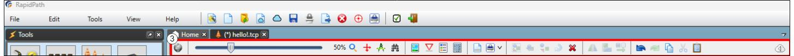

This section is larger, so we'll partition it in two:

### Left Side

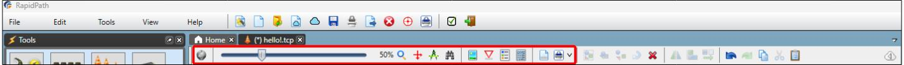

| Icon |Function      |  Description|
|------|----------|-----------------|
| |**Toggle Base Map Visibility**   |Toggle whether the base map is visibile on *mapped plans*.  |
||**Zoom slide bar**   |Used to increase/decrease zoom.  |
| |**Magnifying glass**   |Includes several zoom-related options on mouse hover:  - Reset Zoom: Resets zoom to 100%. - Zoom In/Zoom Out: 20% increments. - Select An Area to Zoom To: Click the function then draw a selection box on plan to zoom to that area. - Adjust Zoom to Active Print Region: Moves your view to the active print region. - Adjust Zoom to See All Objects on Plan. - Adjust Zoom to See Selected Objects.   |
| |**Scroll to Plan Origin**   |Scroll to the coordinates that were set as the plan location during setup in the New Plan Wizard.  |
| |**Measurement Tools**   |Open the measurement tools dialog box - a precise set of measurement tools that can be converted to marker measurement tools if saved.  |
|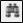 |**Find and Replace Signs**   |Used to Find or Find and Replace Signs.  |
| |**Toggle Colour/Fax mode**   |Toggle between full colour or fax mode for clearer black/white printing/faxing.  |
| |**Toggle Sign Codes**   |Toggle whether the code of a sign place on the canvas has a text below it stating its code.  |
|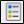 |**Add Legend Box**   |Add a legend to your plan.  |
| |**Add a Manifest Box**   |Add a manifest to your plan.  |
| |**Edit Plan Print Frame**   |Add or edit a print frame for your plan.  |
|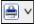 |**Add Print Region**   |Add a print region to your plan  |

### Right Side

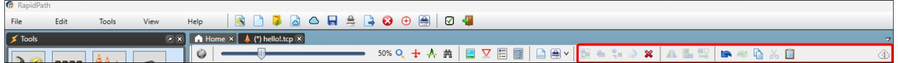

| Icon |Function      |  Description|
|------|----------|-----------------|
|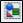 |**Select All**   |Select all objects in the canvas area.  |
| |**Group**   |Group selected objects.  |
|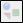 |**Ungroup**   |Ungroup a selected grouped object.  |
| |**Rotate**   |Rotate a selected object/s 90° clockwise.  |
| |**Delete**   |Delete a selected object.  |
|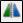 |**Flip**   |Flip selected object/s horizontally.  *On mouse hover:* Flip Selected Object Vertically.  |
| |**Align**   |Align selected objects, horizontally or vertically.  *On mouse hover:* Options for various alignments.  |
|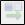 |**Distribute**   |Distrutes selected objects an equal distance apart from each other in a given space, either horizontally or vertically. (Must have at least 3 objects selected) |
| |**Undo**   |Undoes your last action.  |
|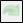 |**Redo**   |Redo a change made using undo.  |
| |**Copy**   |Copy the selected object/text.  |
| |**Cut**   |Cut the selected object/text.  |
| |**Paste**   |Paste from your clipboard to the canvas.  |

