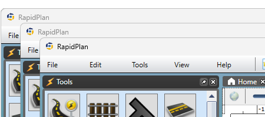

# Running multiple windows

RapidPlan can run multiple application windows at the same time.

## Why this is useful

Multiple windows help when you want to:

- compare plans side by side
- keep reference material open while editing another plan
- work on separate jobs without constantly switching tabs

## Open a new window

Use **File** > **New window** to open another RapidPlan window.

There is also a keyboard shortcut for this command in current RapidPlan releases.

## Open a plan in a new window

Saved plans can also be opened in a separate window from the relevant plan context menu.

This is useful when you want one window per active plan instead of several tabs in the same window.

## Notes

- A plan normally needs to be saved before it can be opened in a new window.
- Multi-window workflows are especially helpful when combined with shared basemap, import, print, or review work.
