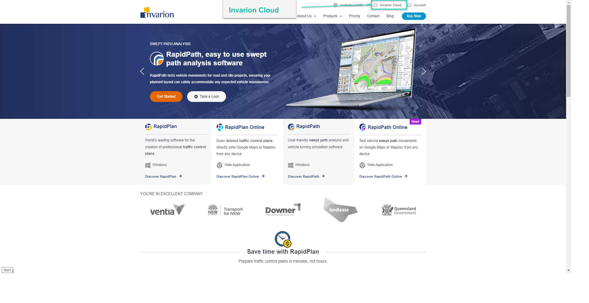
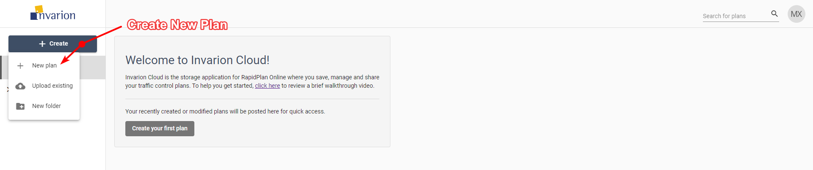

---

sidebar_position: 1

---
# Getting Started

To start using RapidPlan Online, first log into your Invarion Cloud account. You can find the Invarion Cloud [here](https://cloud.invarion.com/home), or it can be found by clicking the Invarion Cloud button on our home screen at [invarion.com](https://invarion.com) in the top right of the page.

## Creating your first plan

To create your first plan, from the Invarion Cloud click the **Create** button and choose **New plan** from the menu. After clicking this you will be taken to **RapidPlan Online**.

Later, you can find your plan in the **Plans** sections inside **Invarion Cloud**.
More details on using the Invarion Cloud can be found in the [Invarion Cloud](/docs/rapid-online/The%20Invarion%20Cloud/) section.
