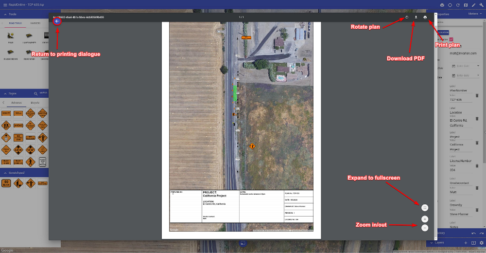

---

sidebar_position: 2

---
# Printing and exporting plans

Once the **Get PDF** button has been selected, you will be able to Print or Download your plan to PDF.

As shown in the image above, clicking the **Download PDF** button will allow you to save your plan as a PDF file. This will then open your default PDF application and show you a preview of your downloaded plan. Clicking **Print plan** will open your default printer dialogue.
