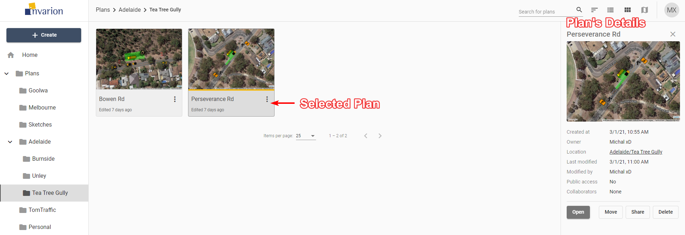
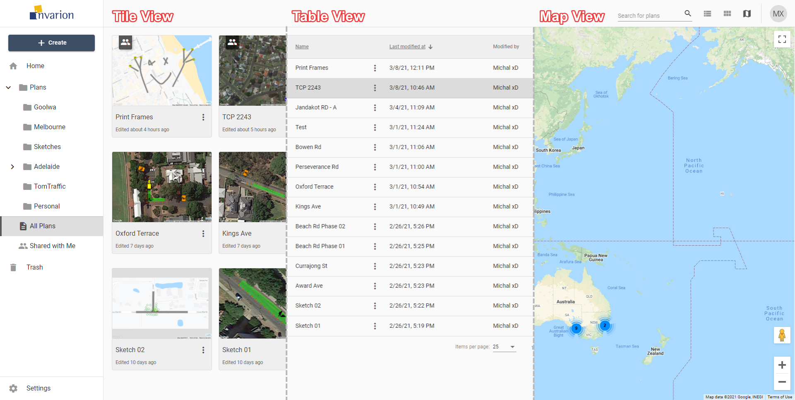

---

sidebar_position: 3

---
# Using Invarion Cloud

Invarion Cloud is an online application for storing all your plans and related documents. It is also the entry point to the RapidPath Online and other web-based Invarion applications.

**Note:** Invarion Cloud has superseded our old storage application, the RapidPlan Cloud.

## Layout

Invarion Cloud is a dynamic web-application that consists of four main elements:

| Element             | Description                                                  |
| ------------------- | ------------------------------------------------------------ |
| **Navigation Menu** | Navigation menu located on the left side of the screen is used to navigate through different sections of the Invarion Cloud such as "Plans", "Trash" or "Shared with Me". Navigation menu also holds "+ Create" button for creating new plans, folders or uploading existing plan from your computer. |
| **Top Bar**         | At the top of the page, on the left side you can find an interactive path to your current location. Right part of the top bar is populated by a search input for searching folders and plans, toggle buttons for switching the type of view and your initials button that holds a link to account settings, support page and logout option. |
| **Main View**       | Main view of the page showing selected folder or section.    |
| **Offcanvas Panel** | Panel on the right side of the screen used for displaying details of selected plan or folder. |

.png)

**Note:** Even though Invarion Cloud is a single page application, it stores your current folder location in your web browser search bar. Thanks to that, you can successfully create browser bookmarks for your favourite or commonly used sections.

## Sections

Invarion Cloud consists of different sections. You can switch between sections using the navigation menu on the left side of the screen.

## Home

When you first open the Invarion Cloud, the Home section is where you land. Here you can see your recently created/modified plans but also plans that have been shared to you recently. Home is divided into three parts:

- **Quick Access** - most recently created, modified or shared to you plans.
- **This Week** - plans that were active this week.
- **This Month** - plans that were active this month.

.png)

## Plans Section

Plans is the main directory, containing all of your folders and files. Click on the arrow next to the plans to expand the folder tree and see your whole folder structure.

Clicking on the folder will take you straight to that location. Your current location is also displayed on the top bar in the form of a path. Each element of the path is clickable:

- Click on the folder's name that is before the current directory to go back.
- Click on the folder's name that is your current directory to display the folder's details in the hideable panel on the right side.

## All Plans

All Plans is a special section that shows all plans that you have access to. That includes plans shared with you by other users. This section doesn't show folders. Plans are displayed regardless of their containing folder.

.png)

**Tips:**

- You can see plan location in plan's details. To do this simply click on the plan, the panel with extra information will show up on the right side of the screen.
- All Plans section was designed to let users quickly find the plan they are interested in.

## Shared with Me

In this section, you can see all the plans that were shared with you by other RapidPath Online users.

.png)

## Trash

Inside the Trash section you can find all your deleted plans and folders. Plans and folders in the trash will be automatically deleted after 30 days.

.png)

You can restore the plan or a folder by choosing "Restore" option in the plan's or folder's context menu. If you want to clean up your trash manually, choose the "Delete forever" option from the same menu.

## Plans

### Creating New Plan

To create a new plan simply click on the "Create" button in the navigation menu and choose "New plan" from the menu. The plan will be created in the folder you are currently in, and you will be taken automatically to RapidPath Online.

### Opening Plans

To open the plan click on it. This will open the panel with plan's details. Look for it on the right side of the screen. Inside the panel click on the "Open" button to open the plan in RapidPath Online.

**Tip:** To open the plan in a separate tab or window, right click on "Open" and choose the desired option from the context menu.

**Note:** Depending on the current view (see *Different Views*) plans can be represented by a rows in a table, tiles or pins on the map.

### Uploading Existing Plan

You can upload the plan from your computer to your online storage. This may come useful when someone shares the RapidPath Online ".tcp" plan with you by other means than through the Invarion Cloud, for example as an attachment to an email.

To upload existing ".tcp" file to your storage click on the "Create" button in the navigation menu and choose "Upload existing" from the menu. The plan will be uploaded to the folder you are currently in.

### Plans Actions

You can see available actions for the plan by clicking on the "three dots" button near its name. This will open plan's context menu with all options listed.

Different actions you can do on plans:

| Action        | Description                                                  |
| ------------- | ------------------------------------------------------------ |
| **Rename**    | Rename plan.                                                 |
| **Delete**    | Move plan to trash.                                          |
| **Duplicate** | Create a copy of the plan. Duplicate will appear in the same location as the original plan. |
| **Move**      | Move plan to a different location.                           |
| **History**   | Restore the previous version of the plan. Read more in chapter (see *Plan's History*) |
| **Download**  | Download plan to your device.                                |
| **Share**     | Opens window with sharing options for the plan. Read more in chapter (see *Sharing Plans*) |

## Folders

Folders help you keep your files organized and separate inside your Invarion storage. They work the same way as they work on your computer.

### Creating New Folder

To create a folder click on "+ Create" a button and choose the "New folder" option. A window will appear with input for the new folder's name. Enter the desired name for the folder and click "Ok". New folder will appear in your current location, and you will be taken straight into it.

**Notes:**

- You can change folder's name at any time using rename option in the folder's context menu on folder's details.
- You can't create a folder inside Home, All Plans or Shared with Me section.

### Folders Actions

You can see available actions for the folder by clicking on the "three dots" button near its name. This will open folder's context menu with all options listed.

Different actions you can do on folders:

| Action     | Description                                           |
| ---------- | ----------------------------------------------------- |
| **Rename** | Change name of the folder.                            |
| **Delete** | Move folder and its contents to trash.                |
| **Move**   | Move folder and its contents to a different location. |

## Details Panel

Plan's or folder's details can be shown in the hideable panel on the right side of the screen. To see them click on a plan that interests you or open the folder. If you already are inside the folder which the details you want to see, click on the folder's name in the top bar.

| Plan's Details    |                                                              |
| ----------------- | ------------------------------------------------------------ |
| **Created at**    | Creation time and date                                       |
| **Owner**         | Plan's owner                                                 |
| **Location**      | Location of the plan in the Invarion Cloud. Clicking on it will take you to the containing folder. |
| **Last modified** | Time and date of the last modification made to the plan.     |
| **Modified by**   | User responsible for the last modification. This is especially useful when collaborating with others. |
| **Public access** | Shows whether the plan has enabled sharing via public link.  |
| **Collaborators** | List of the other collaborators invited to the plan.         |

| Folder's Details |                        |
| ---------------- | ---------------------- |
| **Created at**   | Creation time and date |
| **Created by**   | Folder's owner         |

Additionally, the details panel includes buttons for basic option such as "Open", "Move", "Share", "Delete" for plans, and "Move", "Rename", "Delete" for folders.

**Tip:** Click on plan's or folder's name to rename this plan or folder.

## Different Views

Invarion Cloud lets you view your plans in three different ways:

| View           | Description                                                  |
| -------------- | ------------------------------------------------------------ |
| **Table View** | The Table view presents all of your plans in a table. The table shows the document name, the date it was created, last modified and the editor's name. You can also see if a plan is public, private and or has been shared with a collaborator. You can sort your plans by clicking on column's heading to order by plan's name, creation date or last modified date. |
| **Tile View**  | The tile view presents your plans as a series of thumbnail images. The tiles show a preview of the plan, for easy identification. Shared plans have special overlay icon that indicates that a plan has been shared. To sort in tile view click on "sort" button on the top bar and choose a desired sorting option. |
| **Map**        | The map view displays your plans on a map. This can be useful when searching for a plan at a specific location, or for visualizing clusters of projects within a particular region. Plans displayed on the map will show depending on the folder you are currently in. To see all of your plans on the map, open map view while in the "All Plans" section. |

To change the view use the appropriate buttons on the top bar.

You can change the view at any moment. It won't reset your current location or search results. The view you last selected will be saved in your browser as your default view. So next time you enter Invarion Cloud your preferred view will be shown.

## Searching

In the top right corner of the page you will find search input for searching your plans or folders. Searching will search in the current location (folder). If you want to search in all of your plans, switch to the "Home" or "All Plans" section.

## Sharing Plans

Invarion Cloud features two options for sharing your plans with others.

### Sharing with Other RapidPath Online Subscribers

Sharing plan with other RapidPath Online subscribers will allow for a collaboration in creating the plan. To add collaborators to your plan click on the "Share" option in the plan's context menu or on the plan's details panel. New dialog box will appear. In the top section of the dialog enter RapidPlan Online user's email and click "Add".

Invited user will be notified about this fact in email, and the shared plan will appear in his or her "Shared with Me" section. In your storage this plan will be marked as "shared" and collaborators will be listed in the plan's details. You can add multiple collaborators to a single plan. To remove the collaborator click the "X" button near the email of the user you want to delete.

List of things collaborators can do:

- edit your plan,
- rename your plan,
- duplicate your plan,
- restore the previous version of the plan.

List of things collaborators can't do:

- further share your plan with other people or users,
- move your plan to a different location,
- delete your plan.

You can track the activity on your shared plan using the plan's details where the last modification date and person responsible for the change are listed. Collaborators are also listed in the plan's history where you can restore any previous version of the plan (see **Plan's History**).

### Sharing via Public Link with Anyone

You can share your plan with anyone (including people who don't have RapidPath Online subscription) via a unique link. A Person who has the link can view the document but cannot edit it. This applies to both RapidPath Online subscribers and non users. If you want to share a plan with the editing privilege use the method mentioned in the previous point (see **Sharing with Other RapidPath Online Subscribers**).

To create a sharable link click on the "Share" option in the plan's context menu or on the plan's details panel. A new dialogue will appear. In the bottom section of the dialogue click the "Create share link" button. You can then copy the link and share it with anyone you want. From now on this plan will be marked as "public". You can stop sharing at any time using "Remove share link" option in the same dialogue.

## Plan's History

Invarion Cloud keeps track of every modification made to the plan. Anytime the plan autosaves a new recovery point is made. Thanks to this you can easily go back to any previous version of the plan undoing some unwanted changes made by yourself or other collaborators. It is like turning back the clock.

To use recovery options select "History" from the plan's context menu. A new dialogue will appear listing all the possible recovery points for this plan. Select the one you are interested in and choose one of two options, "Restore this version" or "Create copy".
The former restores the original plan to the selected previous version. The latter creates a new plan from information saved in the selected recovery point. Recovery points listed in the "History" dialogue are divided by date. Additionally to that each one has unique number, timestamp and user responsible for the modification made to the plan.

**Note:** If you restore a previous version of the plan, you will still have access to the later versions of the document. So, no risk is involved.

**Tip:** Plan's history may also come in handy when something unexpected happens to your plan. You can then retrieve last correctly working version of the plan.

## Settings

To enter settings use the "Settings" button at the bottom of the navigation menu. From here you can visit your account page to change your password or edit your billing details. You can also change your default plan settings such as author and company name, your website or upload a company logo. This information will be used to populate the title block when used in RapidPath Online.

.png)

## Logging Out and Contact

To Log out of the Invarion Cloud click on the "your initials" button in the top-right corner of the screen and choose "Logout".

If you have any questions about Invarion Cloud, or you would like to see a particular feature added, please feel free to contact us. To open contact page click on the "your initials" button in the top-right corner of the screen and choose "Support".
