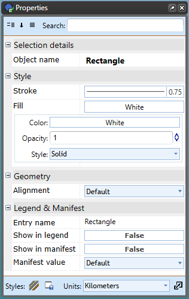

---

sidebar_position: 7

---
# The Shapes Properties

A shape is defined by its outline and an internal area - each handled separately. Similar to lines, the **shape's** outline style is set by altering the stroke settings. The properties for the internal area are set by modifying the fill used for the shape.

You have three controls for the fill: **Color, Opacity and Style.**

## The "Transparent" Color

One of the color settings for lines, shapes and text is **transparent**. In the case of lines including shape outlines this effectively just means **none**. For the fill of shapes however, a transparent setting allows you to see what's underneath. Don't confuse **transparent** with **white**. As the diagram below shows, they are very different.

