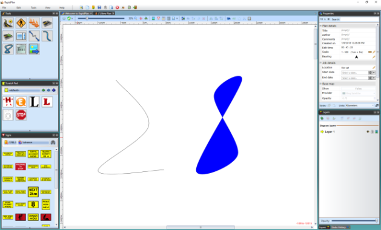

---

sidebar_position: 8

---
# The Spline-Based Tools

The **Spline** and **Filled Spline** have an extra property. They are different because they are built around what is known as a spline curve. Spline curves are formed by placing points along a desired path - RapidPlan uses a predefined curve radius and creates the curved line. (The road tool also is a spline curve).

