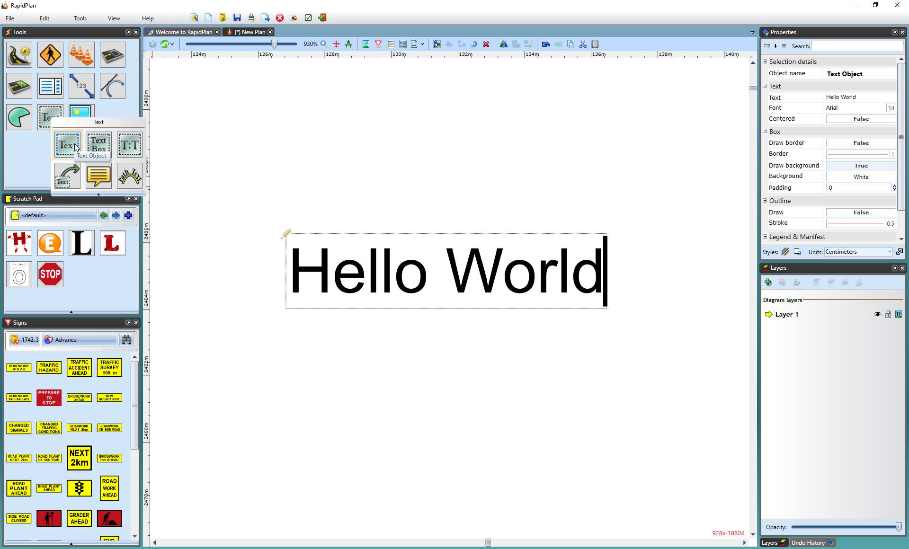

---

sidebar_position: 12

---
# The Text Object Tool

This tool creates an **object** out of text that can be manipulated like any other object.

- Select the **Text Object** tool from the Text tab.
- Place it on the canvas with a click, then a writing cursor will appear in that place.
- Type in your content then use the Properties Palette to make any changes.
- If you wish to change the text content, font style, size or color, or to center the text, click the Text tab in properties and make any necessary adjustments.
- If you wish to paint the background of the text box, click the Box tab in properties and make your adjustments.

    
