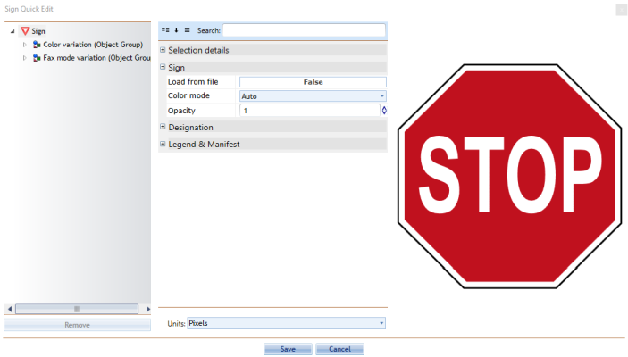

---

sidebar_position: 8

---
# The Properties Palette

The Properties palette displays all the information pertaining to any selected signs, tools, markers or objects that is currently selected. This is where you can change fonts, colors, lane markers, etc. of the selected feature.
If no object is selected on [the canvas](./The%20Canvas.md) at the time, the Properties Palette will display information about the plan itself.

You can also double-click an item from your plan to display the property parameters in Quick Edit mode.

