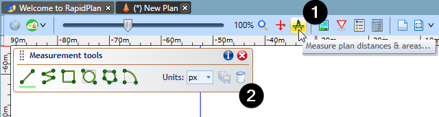
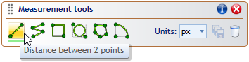
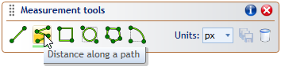
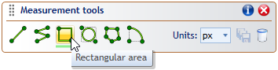
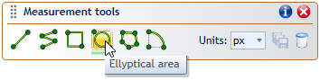
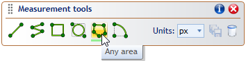
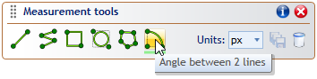
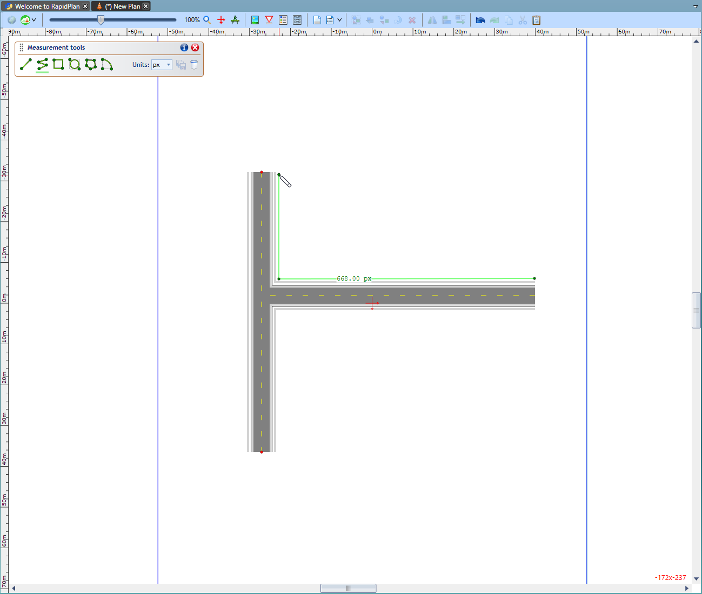

---

sidebar_position: 9

---
# Measurement Tools

The measurement tools will enable you to quickly measure distances, angles and areas on your plan. Measurements are precise, zoom-independent and can be saved as marker objects.

Click on to the measurement tools button to bring up the toolbar - there are 6 different measurement tools to work with as well as appropriate measurement units to apply.

Each measurement tool just requires a click and then another click at desired point/s to find the measurement between different points.

|Measurement Tools                                              |                                   |
|:-------------------------------------------------------------:|-----------------------------------|
|                 | Measure distance between 2 points |
|                 | Measure distance along a path     |
|           | Measure a rectangular area        |
|            | Measure circular/elliptical area  |
|                   | Measure any area                  |
|    | Measure angle between two lines   |

