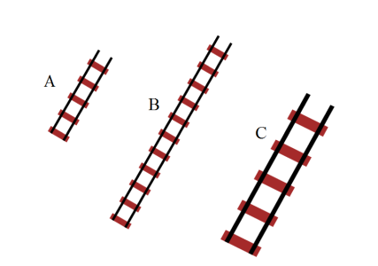

---

sidebar_position: 24

---
# Comparing the Two Methods

It is critically important to understand the distinction between resizing using control points and resize handles so we have compared the two methods below.

Below is three sections of rail line. Section A is the original piece (5 sleepers). Section B has had its control points moved, lengthening it and adding sleepers (11 sleepers). Section C is the original piece, resized using the resize handles. Notice that C still has the same number of sleepers (5) but is much larger. The resize handles have effectively rescaled the section of track.

