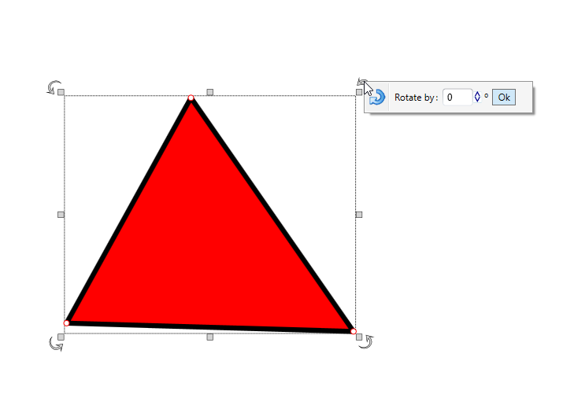

---

sidebar_position: 12

---
# Rotating Objects

Frequently it will be necessary to rotate an item on a plan. There are three methods of rotation:

- Free rotate with the rotation handle.
- Right clicking an object/tool and select **Transform** > **Rotate clockwise**, **Rotate counter-clockwise**, **Rotate upside down** or custom **Rotate by degrees** options.
- On selected object, right click on Rotation Handles (curved arrows) on corners.
- Hit **CTRL + R** when an object is selected and it will rotate in 90 degrees increments.
- Micro rotate clockwise with **CTRL + ALT + R** or counter-clockwise with **CTRL + ALT + E**.

    

    **Note:** You can rotate one or more selected objects at the time.
