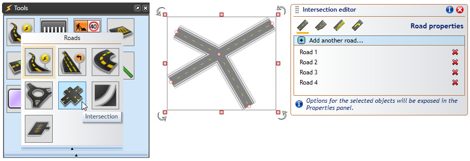

---

sidebar_position: 21

---
# Creating and editing intersections

The Intersection tool is available from the Tools palette, in the Roads category. After selecting the tool, the first click positions the center of the intersection, then subsequent clicks add roads to the intersection. Once you've placed 3 or more roads, right-click to finish drawing, right-click again to release the tool, then click on the intersection to select it (TIP: alternatively, double-click when placing the last road - this will finish the drawing and select your object in one go).  

When an intersection object is selected, Control Points are available to adjust the length and position of incoming roads, and the Intersection Editor panel is displayed - this is where you will be editing intersection elements. To change style of an incoming road, for example to change the number of lanes, select it in the editor list and its style options will be exposed in the Properties panel.  

 
