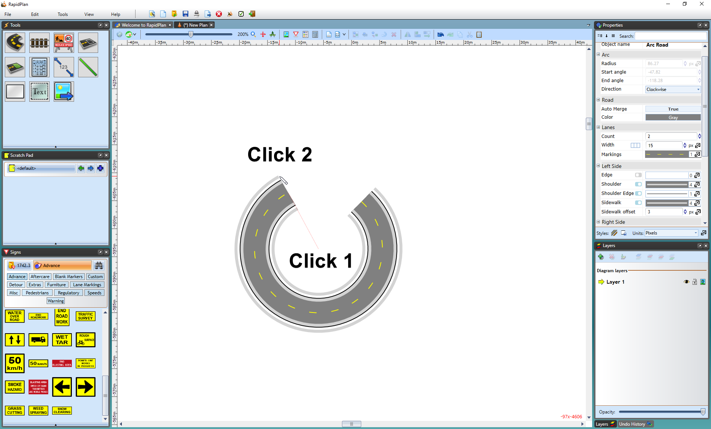
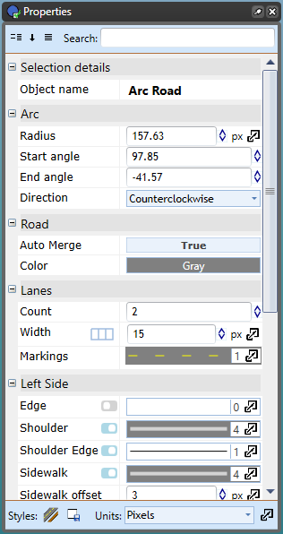

---

sidebar_position: 2

---
# The Road Arc Tool

This tool allows you to create a precise arc in a road with ease. As you can see in the images below, it is created from a radius.

**To create a Road Arc:**

- Select the **Arc Road** tool in the Roads tab of the Tools palette
- Click once to set the radius of the road arc
- The second click is where you start drawing your road arc from
- Now drag your cursor in the direction you want the road
- Click to place the road
- Right click to drop the tool

    

You can also choose to set the arc's radius, angle and direction manually in the **Arc** tab of the Properties Palette.

