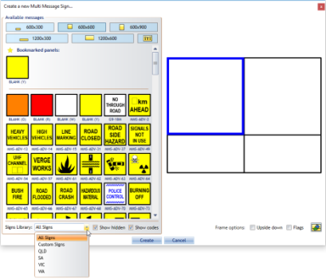
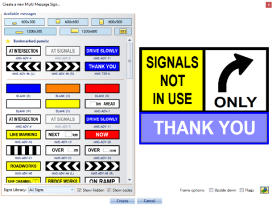
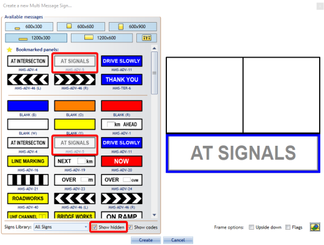

---

sidebar_position: 11

---
# Creating a Multi Message Sign

When this tool is selected, a **Multi Message Sign Wizard** box will appear where you make all the necessary adjustments to the message board you will be utilizing in your plan. You will have many different signs to choose from and select up to four signs for the message board. You can filter signs by state's library (**QLD**, **SA**, **VIC**, **WA**) and you can have your own **Custom Signs**.

**Multi Message sign placement:**

- Select the **Multi Message Sign** tool from the Devices tab in the Tools Palette
- Toggle through the size tabs to view the signs available in each size category and preview the placement of each sign in the preview pane on the right
- Select the signs and placement you want to add to the message board
- Click **Create** to update the marker

    

Click on **Upside down** checkbox if you need to replace pane position and **Flags** if you need on top corners of Multi Message Sign.

If you use some of the signs very often, you can bookmark it. Right click on sign you want to place on **Bookmarked panels** and select **Add to Bookmarks**. To remove it from **Bookmarked panels** right click on bookmarked sign and select **Remove from Bookmarks**

If there are some signs that you never use them, you can hide it from your signs list. Right click on sign you want to hide and select **Hide panel** (**Note:** It will be hidden even if it is placed on **Bookmarked panels**).

To show hidden signs, click on **Show hidden** checkbox and you will see all the signs. Hidden signs will be grayed out.

