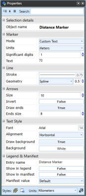

---

sidebar_position: 23

---
# Distance Markers

There are six distance markers used for indicating spatial information on your plan, the Distance Marker, the Combined Distance Marker, the Offset Distance Marker, the Angle Marker, the Area Marker and the Combined Offset Distance Marker.

In essence, all six distance markers do exactly the same thing - they indicate to a reader the distance between elements. They all automatically calculate the distance and enter its amount. You can also enter your own values if needed.

## Creating a Distance Marker

Irrespective of which distance marker you are using, the technique for creating it is much the same. However, there are some differences, so this will be explained separately for each marker below.

**To place a Distance Marker:**

- Select the **Distance Marker** tool from the Marker tab in the Tools Palette.
- Click once to start drawing the distance marker, click a second time to mark the end point.
- Right click to finish

**Note**: It is helpful to hold **SHIFT** whilst drawing the distance marker to keep it straight.

## Changing a Distance Marker's Properties

For each of the distance markers, you can change the arrow size, stroke width and color, font color etc. Utilize the Properties palette to edit all settings for each marker.

